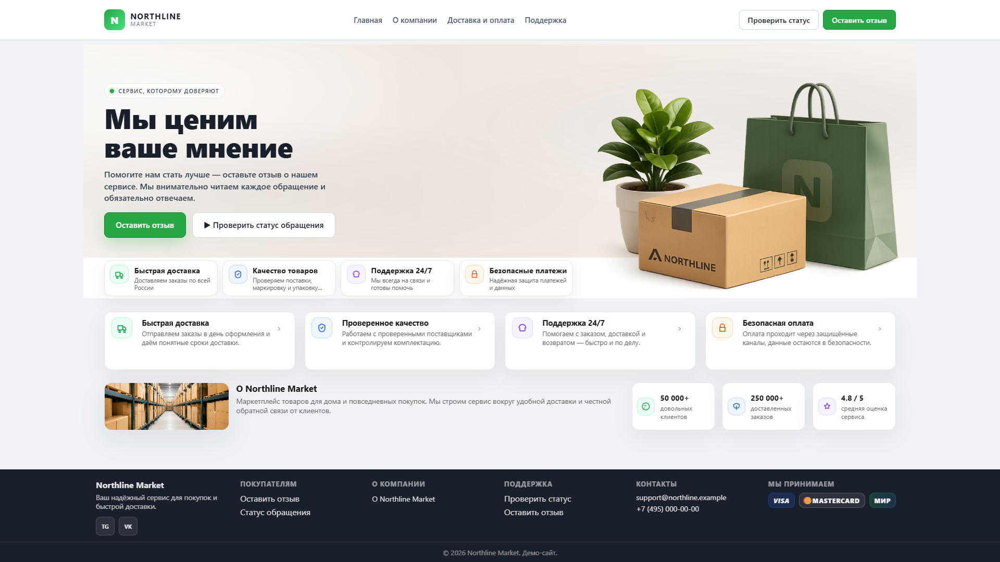
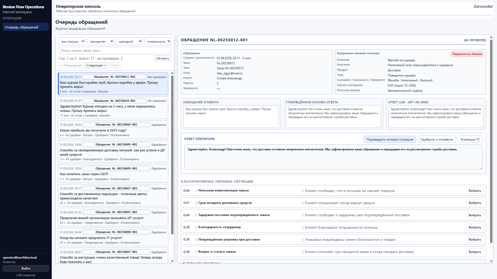
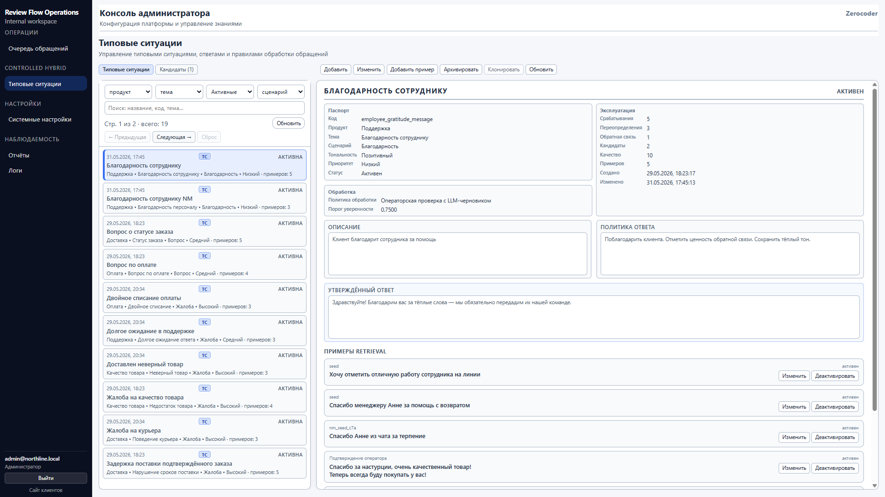
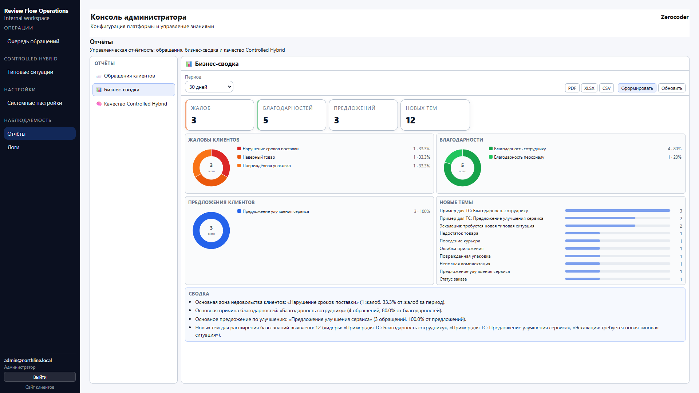
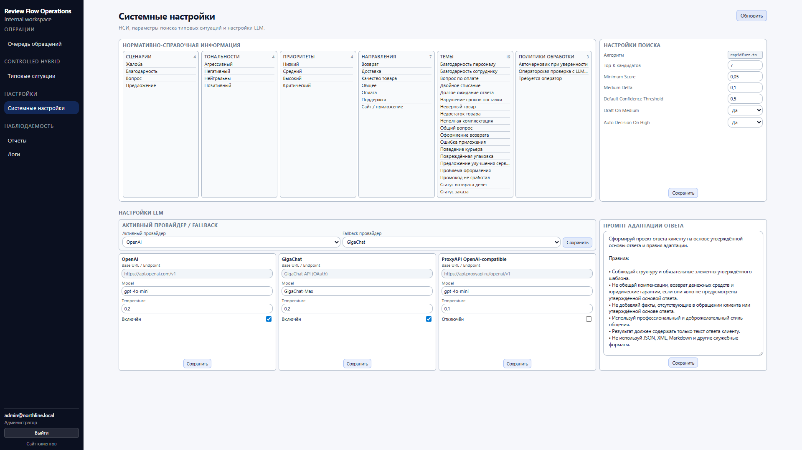

# Review Flow

Демонстрационный MVP для обработки клиентских обращений (отзывов) с разделением ролей и **Controlled Hybrid** подходом: **типовая ситуация (Response Case) — Source of Truth бизнес‑решения**, retrieval подбирает подходящую ситуацию по примерам, а **LLM используется для адаптации текста ответа в рамках утверждённой политики**.

## Какую проблему решает

Если обращения обрабатываются вручную — растут издержки и падает качество из‑за разнобоя в решениях. Review Flow показывает, как:

- фиксировать бизнес‑решения в базе типовых ситуаций;
- ускорять обработку через retrieval + пороги уверенности (confidence);
- оставлять контроль за оператором (Human‑in‑the‑Loop);
- развивать базу знаний через Candidate Learning Loop.

## Почему Controlled Hybrid (а не LLM‑first / полный RAG)

Ключевые причины выбора подхода:

- **бизнес‑решение не делегируется LLM** (LLM может ошибаться непредсказуемо);
- решение опирается на **управляемую базу типовых ситуаций** и аудитируемый retrieval;
- LLM используется там, где он уместен: **переформулирование/адаптация текста** в рамках `response_policy`.

Подробное обоснование: [Обоснование выбора Controlled Hybrid](docs/architecture/controlled_hybrid_architecture_rationale.pdf).  
Главные документы по архитектуре: [Controlled Hybrid](docs/CONTROLLED_HYBRID.md), [Архитектура](docs/ARCHITECTURE.md).

## Основные возможности

- **Клиент**: отправить обращение, получить номер, проверить статус, увидеть опубликованный ответ.
- **Оператор**: очередь обращений, просмотр предложенной типовой ситуации и confidence, правка ответа, публикация, эскалация через “нет подходящей ситуации”.
- **Администратор**: управление типовыми ситуациями и примерами, обработка кандидатов, настройка AI‑провайдеров, отчётность.
- **Руководитель/аналитик**: отчёты по обращениям и качеству обработки (в рамках текущего MVP).

## Роли и контуры

В проекте различаются интерфейсные контуры (см. [План разделения UI‑контуров](docs/architecture/ui_contour_separation_plan.md)):

- **Клиентский контур**: публичные страницы `/`, `/review`, `/review/status`.
- **Контур компании (оператор)**: `/operator/reviews`.
- **Контур компании (администратор)**: `/reports`, `/logs`, `/prompts`, `/evaluation`, `/settings/*`, `/admin/*`.

## Как работает основной pipeline (реализовано)

```text
Клиент создаёт обращение
→ Backend сохраняет review в PostgreSQL
→ Controlled Hybrid pipeline:
     retrieval подбирает Response Case по примерам
     система вычисляет confidence и показывает его оператору
     система формирует draft на основе response_policy + approved_response_text
     (LLM — только адаптация текста, не выбор бизнес-решения)
→ Оператор подтверждает/меняет ситуацию, редактирует ответ и публикует
→ Клиент видит опубликованный ответ по номеру обращения
```

Переключение режима: `CH_PIPELINE_ENABLED=true|false` (см. `.env.example`).

## Controlled Hybrid Learning Loop (демо‑сценарий)

```text
Обращение клиента
→ retrieval предлагает неподходящую или недостаточно уверенную типовую ситуацию
→ оператор выбирает “ни одна типовая ситуация не подходит”
→ оператор предлагает новую типовую ситуацию (candidate)
→ администратор видит кандидата
→ администратор создаёт новую типовую ситуацию или присоединяет к существующей
→ кандидат становится retrieval‑примером
→ новое похожее обращение распознаётся с высокой уверенностью
```

## Скриншоты ключевых экранов

Клиентский портал:



Операторская консоль:



Администрирование базы знаний (Response Cases):



Отчётность и настройки:




Полная галерея и пояснения: [Галерея экранов](docs/SCREENSHOTS.md).

## Технологический стек

- **Frontend**: React + Vite + React Router
- **Backend**: FastAPI (Python 3.12), SQLAlchemy
- **DB**: PostgreSQL 16
- **AI**: OpenAI‑compatible API (в демо возможен `mock`‑провайдер)
- **Запуск**: Docker Compose

## Быстрый запуск

```bash
cp .env.example .env
docker compose up --build
```

После запуска:

- Frontend: `http://localhost:5180`
- Backend API: `http://localhost:8700`
- Health: `http://localhost:8700/health`

Подробные инструкции: [Запуск и деплой](docs/DEPLOYMENT.md).

## Подробная документация

- [Архитектура](docs/ARCHITECTURE.md) — контуры, API, БД, pipeline
- [Controlled Hybrid](docs/CONTROLLED_HYBRID.md) — подход в терминах Review Flow
- [Руководство пользователя](docs/USER_GUIDE.md) — клиент/оператор/админ
- [Галерея экранов](docs/SCREENSHOTS.md)
- [История проекта](docs/PROJECT_HISTORY.md)
- Нормативный SOT: [Архитектурные и продуктовые решения](Архитектурные_и_продуктовые_решения_проекта_SOT_v4.md)
- План реализации: [Implementation plan](IMPLEMENTATION_PLAN.md)

## Ограничения демо

- Это **демонстрационный MVP**: часть функций может быть реализована в упрощённом виде (например, mock‑провайдер LLM).
- Роли переключаются в рамках одного приложения (см. [План разделения UI‑контуров](docs/architecture/ui_contour_separation_plan.md)).
- Содержимое базы типовых ситуаций — учебный seed‑набор для демонстрации retrieval и learning loop.
