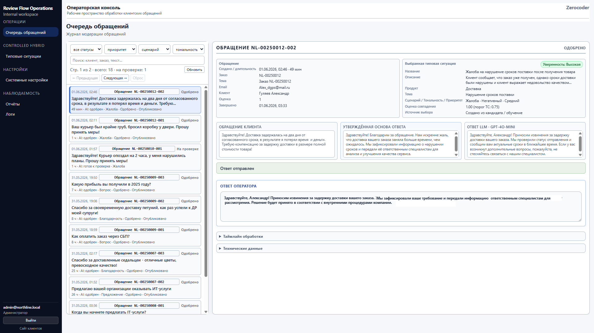
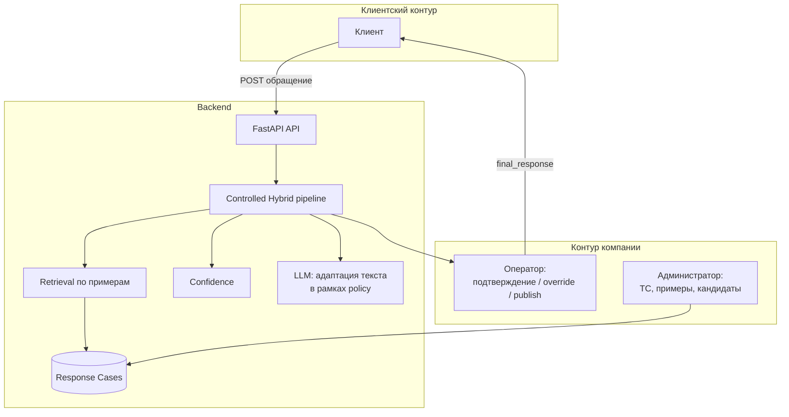

# Review Flow

**Review Flow** — демонстрационный MVP для обработки клиентских обращений, в котором AI используется **управляемо**: бизнес-решения фиксируются в базе типовых ситуаций, а не передаются модели «на усмотрение». Подробное соответствие исходному ТЗ зафиксировано в [отчёте о соответствии ТЗ](docs/TZ_COMPLIANCE_REPORT.md).

Проект показывает полный цикл: от обращения клиента до публикации ответа и последующего **обучения базы знаний** через реальные кейсы операторов.

## Быстрая навигация

### Для знакомства с проектом

- [Отчёт о соответствии ТЗ](docs/TZ_COMPLIANCE_REPORT.md)
- [Руководство пользователя](docs/USER_GUIDE.md)
- [Руководство по развёртыванию](docs/DEPLOYMENT.md)

### Для изучения архитектуры

- [Архитектура](docs/ARCHITECTURE.md)
- [Controlled Hybrid](docs/CONTROLLED_HYBRID.md)
- [Обоснование выбора Controlled Hybrid (PDF)](docs/architecture/controlled_hybrid_architecture_rationale.pdf)

### Для развития проекта

- [Дорожная карта](docs/ROADMAP.md)
- [История проекта](docs/PROJECT_HISTORY.md)
- [Implementation plan](IMPLEMENTATION_PLAN.md)
- [Архитектурные и продуктовые решения (SOT)](Архитектурные_и_продуктовые_решения_проекта_SOT_v4.md)

---

## Проблема

Три типичных крайности не дают устойчивой операционной модели:

| Подход | Ограничение |
|--------|-------------|
| **Ручная обработка** | плохо масштабируется; растут издержки; качество зависит от отдельных сотрудников |
| **Полностью автоматический LLM** | решения плохо контролируются и воспроизводятся; сложно аудировать |
| **«Модель решает за бизнес»** | организация не может формально делегировать принятие решений black-box модели |

Review Flow ищет баланс: **автоматизация там, где она прозрачна**, и **человек там, где нужна ответственность**.

---

## Почему Controlled Hybrid

**Controlled Hybrid** — архитектура, в которой:

- **типовая ситуация (Response Case)** — Source of Truth бизнес-решения (политика ответа, утверждённая основа текста);
- **retrieval** подбирает наиболее подходящую типовую ситуацию по примерам обращений;
- **confidence** рассчитывается системой на основе результата retrieval;
- **LLM не выбирает типовую ситуацию и не принимает бизнес-решение** — только адаптирует текст ответа в рамках `response_policy` / `approved_response_text`;
- **оператор** остаётся Human-in-the-Loop: подтверждает, меняет или эскалирует;
- **администратор** развивает базу знаний: типовые ситуации, retrieval-примеры, кандидаты.

Чем отличается от типичного LLM-first: решение не «рождается в промпте», а **находит опору в управляемой KB** и правилах backend.

Подробное обоснование: [Обоснование выбора Controlled Hybrid](docs/architecture/controlled_hybrid_architecture_rationale.pdf) · [Controlled Hybrid](docs/CONTROLLED_HYBRID.md) · [Архитектура](docs/ARCHITECTURE.md)

---

## Controlled Hybrid Learning Loop

Главный сценарий проекта — **замыкание цикла обучения**: операционный сигнал превращается в новое знание, которое улучшает последующий retrieval.


**Шаги в системе:**

1. Клиент создаёт обращение.
2. Retrieval предлагает неподходящую или недостаточно уверенную типовую ситуацию.
3. Оператор фиксирует: «ни одна типовая ситуация не подходит», создаёт **candidate**.
4. Администратор обрабатывает кандидата: создаёт новую типовую ситуацию или присоединяет к существующей.
5. Обращение-кандидат становится **retrieval-примером**.
6. Следующее похожее обращение распознаётся с **высокой уверенностью** — без смены бизнес-логики «вручную» на каждый раз.

Скриншоты этого сценария — в разделе [Демонстрация системы](#демонстрация-системы) (оператор → администратор).

---

## Демонстрация системы

Ниже — сквозная история по ролям. Все изображения из [`docs/screenshots/`](docs/screenshots/).

### Клиент

Публичный контур: клиент не видит внутренних инструментов, confidence и типовых ситуаций.

**Главная** — вход в сценарий «оставить обращение» / «проверить статус».


**Создание обращения** — форма и отправка; система выдаёт номер обращения (`NL-…`).


**Отслеживание статуса** — этапы обработки и опубликованный ответ после действий оператора.


---

### Оператор

Рабочее место: очередь обращений, предложенная типовая ситуация, confidence, правка и публикация ответа.

**Карточка обращения** — human-in-the-loop: редактирование ответа перед публикацией.


**Confidence и альтернативы** — retrieval предлагает ТС; при низкой уверенности оператор видит Top-N и принимает решение осознанно.


**Запуск learning loop** — «нет подходящей ТС» → candidate.


**Результат после расширения KB** — похожее обращение обрабатывается с высокой уверенностью.



Вход в контур компании (выбор роли): [`oper-logun.png`](docs/screenshots/oper-logun.png)

---

### Администратор

Управление базой знаний Controlled Hybrid.

**Типовые ситуации (Response Cases)** — SOT бизнес-решений: политика, утверждённый текст, пороги.


**Кандидаты** — очередь предложений от операторов.


**Создание новой типовой ситуации** — кандидат превращается в элемент KB.


**Retrieval-пример** — candidate добавлен к типовой ситуации; последующий подбор улучшается.


---

### Руководитель

Отчётность по обращениям и качеству обработки (демо-витрина MVP).


---

### Настройка системы

Системные параметры и AI-провайдеры (в демо возможен `mock`-провайдер).


Полная галерея с пояснениями: [Галерея экранов](docs/SCREENSHOTS.md)

---

## Архитектура



**Семантика потока (реализовано при `CH_PIPELINE_ENABLED=true`):**

1. Клиент создаёт обращение → API сохраняет в PostgreSQL.
2. Retrieval ранжирует типовые ситуации по примерам; система вычисляет confidence.
3. Draft формируется из policy и утверждённого текста выбранной ТС; LLM **адаптирует формулировку**, не выбирая ситуацию.
4. Оператор подтверждает или меняет ТС, редактирует ответ, публикует.
5. Администратор поддерживает KB и обрабатывает candidates.

Legacy path (template-guided, для регрессии): `CH_PIPELINE_ENABLED=false` — см. [SOT](Архитектурные_и_продуктовые_решения_проекта_SOT_v4.md) §3.3.

---

## Основные возможности

- Клиентский портал: обращение, номер, статус, опубликованный ответ
- Controlled Hybrid pipeline: retrieval, confidence, decision, bounded LLM adaptation
- Операторская консоль: очередь, override, candidate, публикация
- Админ KB: CRUD типовых ситуаций и retrieval-примеров
- Candidate learning loop (демонстрационный end-to-end сценарий)
- Отчётность и operational logs
- Настройки AI-провайдеров и системные параметры
- Промпты, evaluation, legacy KB (параллельно CH, учебный контур)

---

## Технологический стек

| Слой | Технология |
|------|------------|
| Frontend | React, Vite, React Router |
| Backend | FastAPI, Python 3.12, SQLAlchemy |
| Database | PostgreSQL 16 |
| AI | OpenAI-compatible API (в демо — `mock`) |
| Deploy | Docker Compose |

---

## Быстрый запуск

```bash
cp .env.example .env
docker compose up --build
```

После запуска:

| Сервис | URL |
|--------|-----|
| Frontend | http://localhost:5180 |
| Backend API | http://localhost:8700 |
| Health | http://localhost:8700/health |

Подробные инструкции: [Запуск и деплой](docs/DEPLOYMENT.md)

---

## Документация

- [Отчёт о соответствии исходному ТЗ](docs/TZ_COMPLIANCE_REPORT.md)
- [Архитектура](docs/ARCHITECTURE.md)
- [Controlled Hybrid](docs/CONTROLLED_HYBRID.md)
- [Руководство пользователя](docs/USER_GUIDE.md)
- [Галерея экранов](docs/SCREENSHOTS.md)
- [История проекта](docs/PROJECT_HISTORY.md)
- [Архитектурные и продуктовые решения (SOT)](Архитектурные_и_продуктовые_решения_проекта_SOT_v4.md)
- [Implementation plan](IMPLEMENTATION_PLAN.md)

---

## Ограничения демо

- **Демонстрационный MVP**: упрощённые сценарии; возможен `mock`-провайдер LLM (заглушка текста, не полноценная адаптация) — см. [CH pipeline forensics](docs/architecture/ch_pipeline_forensics_after_ch_integration.md).
- Роли переключаются в одном приложении ([план разделения UI-контуров](docs/architecture/ui_contour_separation_plan.md)).
- База типовых ситуаций — учебный seed для демонстрации retrieval и learning loop.
