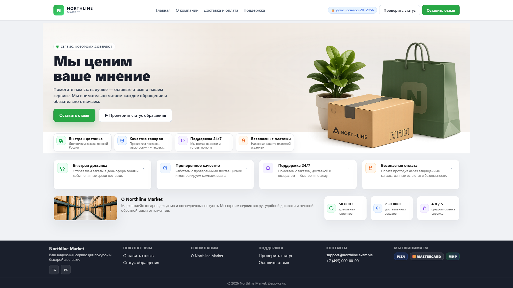
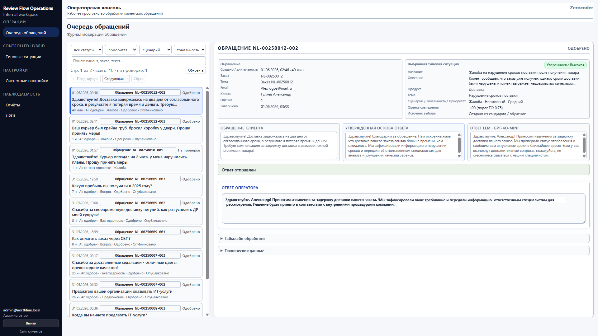

# Review Flow

**Review Flow** — демонстрационный MVP для обработки клиентских обращений, в котором AI используется **управляемо**: бизнес-решения фиксируются в базе типовых ситуаций, а не передаются модели «на усмотрение».

**Статус:** Активный портфельный актив  
**GitHub:** https://github.com/AlexLvGulyaev/Review-Flow  
**Тип:** AI-система обработки клиентских обращений  

Проект показывает полный цикл: от обращения клиента до публикации ответа и последующего **обучения базы знаний** через реальные кейсы операторов.

## Быстрая навигация

### Для знакомства с проектом

- [Отчёт о соответствии ТЗ](docs/TZ_COMPLIANCE_REPORT.md)
- [Руководство пользователя](docs/USER_GUIDE.md)
- [Руководство по развёртыванию](docs/DEPLOYMENT_GUIDE.md)

### Для изучения архитектуры

- [Архитектура](docs/ARCHITECTURE.md)
- [Controlled Hybrid](docs/CONTROLLED_HYBRID.md)
- [Обоснование выбора Controlled Hybrid (PDF)](docs/controlled-hybrid-architecture-rationale.pdf)

### Для развития проекта

- [Дорожная карта](docs/ROADMAP.md)
- [История проекта](docs/PROJECT_HISTORY.md)
- [Implementation plan](docs/IMPLEMENTATION_PLAN.md)
- [Архитектурные и продуктовые решения (SOT)](architecture-decisions-sot-v4.md)

---

## Проблема

Три типичных крайности не дают устойчивой операционной модели:

| Подход | Ограничение |
|--------|-------------|
| **Ручная обработка** | плохо масштабируется; растут издержки; качество зависит от отдельных сотрудников |
| **Полностью автоматический LLM** | решения плохо контролируются и воспроизводятся; сложно аудировать |
| **«Модель решает за бизнес»** | организация не может формально делегировать принятие решений black-box модели |

Review Flow ищет баланс: **автоматизация там, где она прозрачна**, и **человек там, где нужна ответственность**.

---

## Архитектура

**Controlled Hybrid pipeline** — комбинация retrieval, confidence assessment и bounded LLM adaptation:

```
┌─────────────────────────────────────────────────────────────┐
│                    Входящее обращение                        │
└─────────────────────────┬───────────────────────────────────┘
                          │
                          ▼
                ┌─────────────────┐
                │   Retrieval     │
                │ (поиск ТС по    │
                │  примерам)      │
                └────────┬────────┘
                         │
                          ▼
                ┌─────────────────┐
                │  Confidence     │
                │   Assessment    │
                └────────┬────────┘
                         │
          ┌──────────────┼──────────────┐
          │              │              │
          ▼              ▼              ▼
    ┌──────────┐  ┌──────────┐  ┌──────────┐
    │  High    │  │  Medium  │  │   Low    │
    │ Confidence│ │ Confidence│ │ Confidence│
    └────┬─────┘  └────┬─────┘  └────┬─────┘
         │             │              │
         ▼             ▼              ▼
    ┌──────────┐  ┌──────────┐  ┌──────────┐
    │Авто-     │  │LLM       │  │Кандидат  │
    │публикация│  │адаптация │  │для эксперта│
    └──────────┘  └──────────┘  └──────────┘
         │             │              │
         └──────────────┼──────────────┘
                        ▼
              ┌─────────────────┐
              │    Оператор     │
              │ (Human-in-Loop) │
              └─────────────────┘
```

**Ключевые модули:**
- `backend/` — FastAPI API, Controlled Hybrid pipeline
- `frontend/` — React-приложение
- `docs/` — документация, скриншоты

**База знаний:**
- Response Cases (типовые ситуации)
- Retrieval-примеры
- Candidates (кандидаты для пополнения БЗ)

---

## Почему Controlled Hybrid

**Controlled Hybrid** — архитектура, в которой:

- **типовая ситуация (Response Case)** — Source of Truth бизнес-решения (политика ответа, утверждённая основа текста);
- **retrieval** подбирает наиболее подходящую типовую ситуацию по примерам обращений;
- **confidence** рассчитывается системой на основе результата retrieval;
- **LLM не выбирает типовую ситуацию и не принимает бизнес-решение** — только адаптирует текст ответа в рамках `response_policy` / `approved_response_text`;
- **оператор** остаётся Human-in-the-Loop: подтверждает, меняет или эскалирует;
- **администратор** развивает базу знаний: типовые ситуации, retrieval-примеры, кандидаты.

Чем отличается от типичного LLM-first: решение не «рождается в промпте», а **находит опору в управляемой KB** и правилах backend.

Подробное обоснование: [Обоснование выбора Controlled Hybrid (PDF)](docs/controlled-hybrid-architecture-rationale.pdf) · [Controlled Hybrid](docs/CONTROLLED_HYBRID.md) · [Архитектура](docs/ARCHITECTURE.md)

---

## Controlled Hybrid Learning Loop

Главный сценарий проекта — **замыкание цикла обучения**: операционный сигнал превращается в новое знание, которое улучшает последующий retrieval.


```mermaid
flowchart LR
  A["Обращение клиента"] --> B["Retrieval:<br/>низкая уверенность<br/>или неверная ТС"]
  B --> C["Оператор:<br/>«ни одна ТС не подходит»"]
  C --> D["Candidate<br/>(кандидат)"]
  D --> E["Администратор:<br/>новая ТС или<br/>присоединение к ТС"]
  E --> F["Candidate →<br/>retrieval-пример"]
  F --> G["Похожее обращение:<br/>высокая уверенность,<br/>автоматический подбор"]
```

**Шаги в системе:**

1. Клиент создаёт обращение.
2. Retrieval предлагает неподходящую или недостаточно уверенную типовую ситуацию.
3. Оператор фиксирует: «ни одна типовая ситуация не подходит», создаёт **candidate**.
4. Администратор обрабатывает кандидата: создаёт новую типовую ситуацию или присоединяет к существующей.
5. Обращение-кандидат становится **retrieval-примером**.
6. Следующее похожее обращение распознаётся с **высокой уверенностью** — без смены бизнес-логики «вручную» на каждый раз.

Скриншоты этого сценария — в разделе [Демонстрация системы](#демонстрация-системы) (оператор → администратор).

---

## Демонстрация системы

Ниже — сквозная история по ролям. Все изображения из [`docs/screenshots/`](docs/screenshots/).

### Клиент

Публичный контур: клиент не видит внутренних инструментов, confidence и типовых ситуаций.

**Главная** — вход в сценарий «оставить обращение» / «проверить статус».



**Создание обращения** — форма и отправка; система выдаёт номер обращения (`NL-…`).


**Отслеживание статуса** — этапы обработки и опубликованный ответ после действий оператора.


---

### Оператор

Рабочее место: очередь обращений, предложенная типовая ситуация, confidence, правка и публикация ответа.

**Карточка обращения** — human-in-the-loop: редактирование ответа перед публикацией.


**Confidence и альтернативы** — retrieval предлагает ТС; при низкой уверенности оператор видит Top-N и принимает решение осознанно.


**Запуск learning loop** — «нет подходящей ТС» → candidate.


**Результат после расширения KB** — похожее обращение обрабатывается с высокой уверенностью.



Вход в контур компании (выбор роли): [`oper-logun.png`](docs/screenshots/oper-logun.png)

---

### Администратор

Управление базой знаний Controlled Hybrid.

**Типовые ситуации (Response Cases)** — SOT бизнес-решений: политика, утверждённый текст, пороги.


**Кандидаты** — очередь предложений от операторов.


**Создание новой типовой ситуации** — кандидат превращается в элемент KB.


**Retrieval-пример** — candidate добавлен к типовой ситуации; последующий подбор улучшается.


---

### Руководитель

Отчётность по обращениям и качеству обработки (демо-витрина MVP).


---

### Настройка системы

Системные параметры и AI-провайдеры (в демо возможен `mock`-провайдер).


Полная галерея с пояснениями: [Галерея экранов](docs/SCREENSHOTS.md)

---

## Основные возможности

- Публичный клиентский портал: обращение, номер, статус, опубликованный ответ
- Controlled Hybrid pipeline: retrieval, confidence, decision, bounded LLM adaptation
- Операторская консоль: очередь, override, candidate, публикация
- Админ KB: CRUD типовых ситуаций и retrieval-примеров
- Candidate learning loop (демонстрационный end-to-end сценарий)
- Отчётность и operational logs
- Настройки AI-провайдеров и системные параметры
- Промпты, evaluation, legacy KB (параллельно CH, учебный контур)

---

## Технологический стек

| Слой | Технология |
|------|------------|
| Frontend | React, Vite, React Router |
| Backend | FastAPI, Python 3.12, SQLAlchemy |
| Database | PostgreSQL 16 |
| AI | OpenAI-compatible API (в демо — `mock`) |
| Deploy | Docker Compose |

---

## Быстрый запуск

### Локально

```bash
cp .env.example .env
docker compose up --build
```

| Сервис | URL |
|--------|-----|
| Frontend | http://localhost:5180 |
| Backend API | http://localhost:8700 |
| Health | http://localhost:8700/health |

### Публичные демо-точки

| Сервис | URL |
|--------|-----|
| Web UI (клиент + оператор) | https://review-flow.alex-n8n.site |
| Admin Console | https://review-flow-admin.alex-n8n.site |
| Backend API | https://review-flow-api.alex-n8n.site |
| Health | https://review-flow-api.alex-n8n.site/health |

> Демо-входы сотрудников: `operator@northline.local` / `demo` и `admin@northline.local` / `demo`.

Подробные инструкции: [Руководство по развёртыванию](docs/DEPLOYMENT_GUIDE.md)

---

## Документация

- [Отчёт о соответствии исходному ТЗ](docs/TZ_COMPLIANCE_REPORT.md)
- [Архитектура](docs/ARCHITECTURE.md)
- [Controlled Hybrid](docs/CONTROLLED_HYBRID.md)
- [Руководство пользователя](docs/USER_GUIDE.md)
- [Галерея экранов](docs/SCREENSHOTS.md)
- [История проекта](docs/PROJECT_HISTORY.md)
- [Архитектурные и продуктовые решения (SOT)](architecture-decisions-sot-v4.md)
- [Implementation plan](docs/IMPLEMENTATION_PLAN.md)

---

## Ограничения демо

- **Демонстрационный MVP**: упрощённые сценарии; возможен `mock`-провайдер LLM (заглушка текста, не полноценная адаптация) — см. [CH pipeline forensics](docs/ch-pipeline-forensics.md).
- Роли переключаются в одном приложении.
- База типовых ситуаций — учебный seed для демонстрации retrieval и learning loop.

---

## Коммерческие задачи

Проект подтверждает компетенции для следующих типов заказов:

1. **Обработка обращений**
   - Автоматизация работы с клиентскими обращениями
   - Классификация и маршрутизация
   - AI-генерация ответов

2. **Классификация**
   - Автоматическая классификация по категориям
   - Подбор типовых решений
   - Confidence-оценка

3. **Операторские системы**
   - Консоли операторов
   - Human-in-the-Loop системы
   - Контроль качества

4. **Базы знаний**
   - Управление типовыми ситуациями
   - Learning loop (candidate → approved)
   - Экспертные системы

---

## Направления AI Automation Portfolio Lab

| Направление | Покрытие |
|-------------|----------|
| **Обработка обращений** | ✅ Полное |
| **Классификация** | ✅ Полное |
| **AI-генерация ответов** | ✅ Полное (bounded) |
| **Операторские системы** | ✅ Полное |
| **Базы знаний** | ⚠️ Частичное (типовые ситуации) |

---

## Переиспользуемые элементы

### Промпты
- Промпты классификации обращений
- Промпты для bounded LLM adaptation
- Промпты для работы с response_policy

### Архитектурные паттерны
- Controlled Hybrid pipeline
- Human-in-the-Loop
- Candidate learning loop
- Confidence-based routing

### Компоненты
- Классификатор обращений
- Retrieval-движок по примерам
- Система управления типовыми ситуациями
- Операторская консоль

### Утилиты
- Confidence calculator
- Response policy processor
- Candidate management system

---

## Ключевые принципы

1. **LLM не принимает бизнес-решения** — только адаптирует текст в рамках `response_policy`
2. **Оператор — Human-in-the-Loop** — подтверждает, меняет или эскалирует
3. **Администратор развивает KB** — типовые ситуации, примеры, кандидаты

---

## Связанные кейсы

- [[assistant-flow]] — база знаний и RAG
- [[prompt-library]] — библиотека промптов
