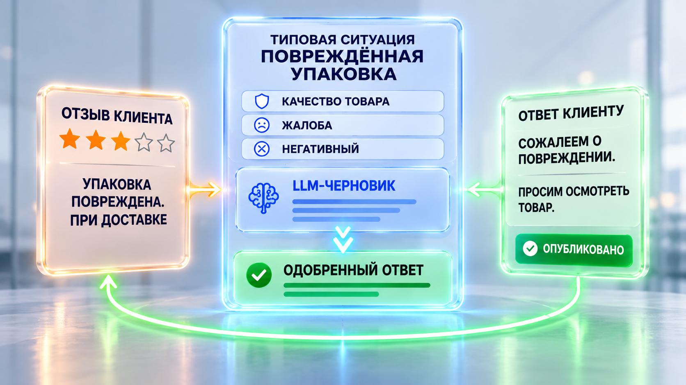
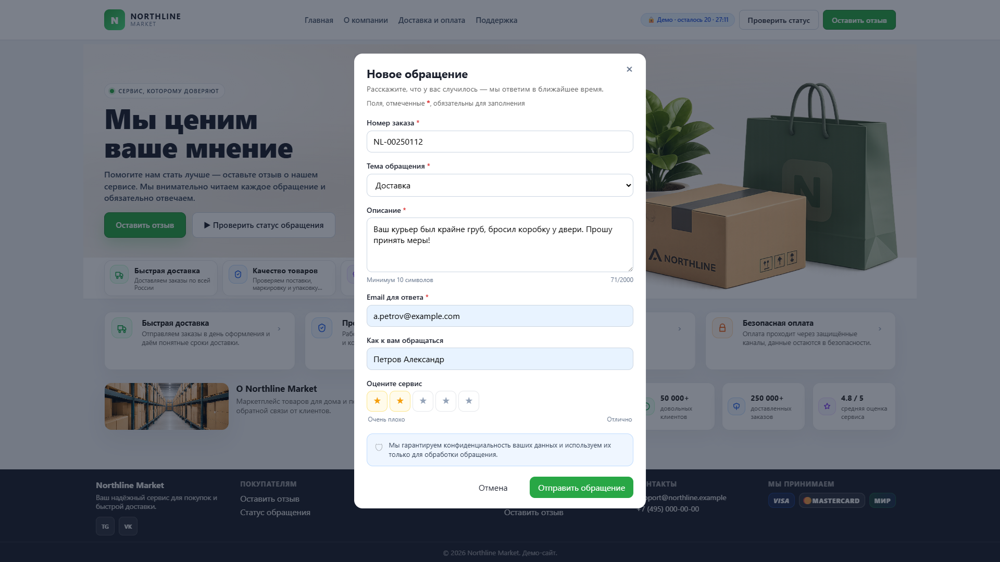
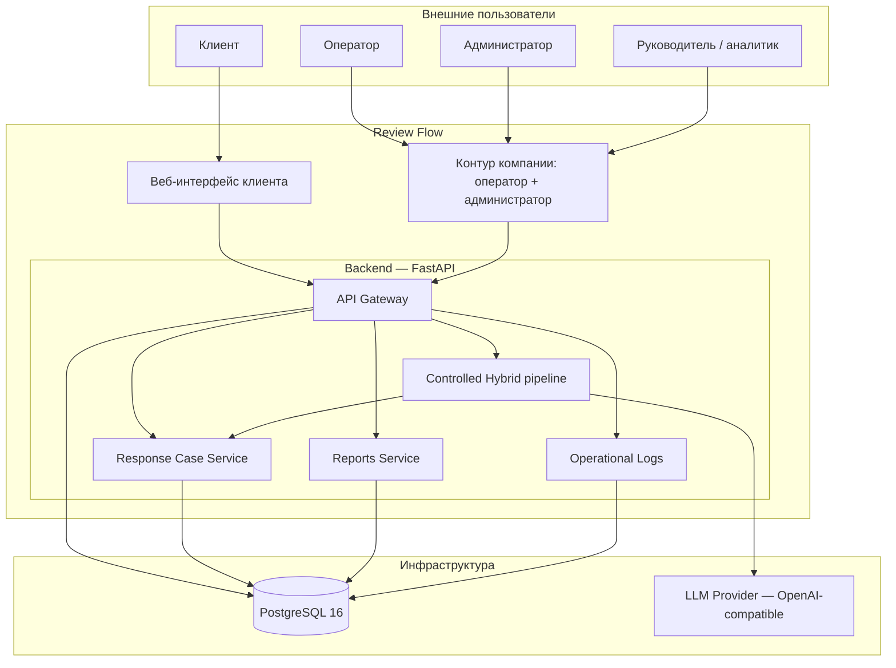

# 🛡️ Review Flow



⚡ **Снижайте нагрузку на поддержку и сохраняйте контроль над ответами клиентам.**

Review Flow — AI-система обработки клиентских обращений, в которой бизнес-решения фиксируются в управляемой базе знаний, а не передаются языковой модели «на усмотрение». Система подбирает типовую ситуацию по похожим примерам, формирует черновик ответа в рамках утверждённой политики и оставляет финальное решение за оператором.

- Клиент оставляет отзыв или вопрос — получает номер обращения и понятный статус.
- Оператор видит предложенную типовую ситуацию, уровень confidence и альтернативы — и публикует ответ.
- Администратор развивает базу знаний: новые типовые ситуации и retrieval-примеры из реальных кейсов.

Review Flow не публикует ответы без оператора, не делегирует бизнес-решения модели и не оставляет повторяющиеся кейсы без знания.

[▶️ Попробовать live demo](https://review-flow.alex-n8n.site) · [📈 Бизнес-ценность](docs/BUSINESS_VALUE.md) · [🎬 Как это работает](docs/SYSTEM_DEMO.md)

---

## ▶️ Live Demo

🌐 **Клиенту:** [▶️ Открыть веб-интерфейс](https://review-flow.alex-n8n.site)

Нажмите **«Оставить отзыв»**, заполните форму и получите номер обращения. Затем проверьте статус по номеру и email — после публикации оператором вы увидите финальный ответ.



Скриншоты, live demo и бизнес-сценарии — в [`docs/SYSTEM_DEMO.md`](docs/SYSTEM_DEMO.md) и [`docs/E2E_SCENARIOS.md`](docs/E2E_SCENARIOS.md).

---

## ❓ Зачем нужен Review Flow

Команды поддержки сталкиваются с тремя типичными крайностями:

| Подход | Ограничение |
|--------|-------------|
| **Ручная обработка** | плохо масштабируется; растут издержки; качество зависит от отдельных сотрудников |
| **Полностью автоматический LLM** | решения плохо контролируются и воспроизводятся; сложно аудировать |
| **«Модель решает за бизнес»** | организация не может формально делегировать принятие решений black-box модели |

**Review Flow решает эту проблему**, используя архитектуру **Controlled Hybrid**:

- **Response Case** — Source of Truth бизнес-решения: политика ответа, утверждённая основа текста, атрибуты случая.
- **Retrieval** подбирает наиболее подходящую типовую ситуацию по примерам обращений.
- **Confidence** рассчитывается системой на основе результатов retrieval.
- **LLM не выбирает типовую ситуацию и не принимает бизнес-решение** — только адаптирует текст ответа в рамках `response_policy` / `approved_response_text`.
- **Оператор** остаётся Human-in-the-Loop: подтверждает, меняет или эскалирует.
- **Администратор** развивает базу знаний через типовые ситуации, retrieval-примеры и кандидатов.

Больше о бизнес-ценности — в [`docs/BUSINESS_VALUE.md`](docs/BUSINESS_VALUE.md).

---

## 🎯 Для кого

- Службы поддержки e-commerce и маркетплейсов.
- Компании с повторяющимися клиентскими обращениями (доставка, оплата, возврат, качество).
- Команды, которые хотят автоматизировать черновики ответов, но сохранить операторский контроль.
- Поставщики CRM и тикет-систем, желающие добавить Controlled Hybrid в экосистему.

---

## ✨ Ключевые возможности

- **Публичный клиентский портал** — обращение, номер `NL-…`, проверка статуса, опубликованный ответ.
- **Controlled Hybrid pipeline** — retrieval, confidence assessment, bounded LLM adaptation.
- **Human-in-the-Loop** — оператор проверяет предложенную типовую ситуацию, confidence и альтернативы перед публикацией.
- **Candidate learning loop** — операторский сигнал превращается в новую или дополненную типовую ситуацию.
- **Управляемая база знаний** — CRUD Response Cases, retrieval-примеры, архивирование/активация.
- **Отчётность** — обращения клиентов, бизнес-сводка, качество Controlled Hybrid, экспорт CSV/XLSX/PDF.
- **Настройки AI-провайдеров и промптов** — версионирование, fallback, runtime-параметры.
- **Честные границы** — staff-вход по Bearer-токену, публичный demo-вход только на чтение (read-only RBAC), без корпоративного SSO; MVP перед production.

---

## 🏗️ Краткий обзор архитектуры


```mermaid
flowchart TB
    subgraph "Внешние пользователи"
        Client[Клиент]
        Operator[Оператор]
        Admin[Администратор]
        Manager[Руководитель / аналитик]
    end

    subgraph "Review Flow"
        WebUI[Веб-интерфейс клиента]
        CompanyUI[Контур компании: оператор + администратор]

        subgraph "Backend — FastAPI"
            API[API Gateway]
            CH[Controlled Hybrid pipeline]
            KB[Response Case Service]
            Reports[Reports Service]
            Logs[Operational Logs]
        end
    end

    subgraph "Инфраструктура"
        DB[(PostgreSQL 16)]
        LLM[LLM Provider — OpenAI-compatible]
    end

    Client --> WebUI
    Operator --> CompanyUI
    Admin --> CompanyUI
    Manager --> CompanyUI

    WebUI --> API
    CompanyUI --> API

    API --> CH
    API --> KB
    API --> Reports
    API --> Logs

    CH --> KB
    CH --> LLM

    API --> DB
    KB --> DB
    Reports --> DB
    Logs --> DB
```

- **Response Case** — Source of Truth бизнес-решений в базе знаний.
- **Controlled Hybrid pipeline** — retrieval, confidence, LLM-адаптация под контролем оператора.
- **Backend** — FastAPI, SQLAlchemy, PostgreSQL.

Подробнее — в [`docs/ARCHITECTURE.md`](docs/ARCHITECTURE.md) и [`docs/CONTROLLED_HYBRID.md`](docs/CONTROLLED_HYBRID.md).

---

## 🌐 Публичные точки входа

| Роль | Сервис | Домен | Назначение |
|------|--------|-------|-----------|
| Клиент | Веб-интерфейс | [review-flow.alex-n8n.site](https://review-flow.alex-n8n.site) | Оставить обращение, проверить статус |
| Оператор | Контур компании | [review-flow-admin.alex-n8n.site/company](https://review-flow-admin.alex-n8n.site/company) | Очередь обращений, модерация, публикация |
| Администратор | Admin Console | [review-flow-admin.alex-n8n.site/company](https://review-flow-admin.alex-n8n.site/company) | Типовые ситуации, кандидаты, настройки |
| Интегратор | Backend API | [review-flow-api.alex-n8n.site/docs](https://review-flow-api.alex-n8n.site/docs) | REST API Review Flow |

> 🔓 **Вход сотрудников:** по Bearer-токену (`OPS_ADMIN_TOKEN` / `OPS_OPERATOR_TOKEN`). Публичный demo-вход — кнопка «Войти в демо-режим (только просмотр)» (`VITE_OPS_DEMO_TOKEN`), read-only RBAC. Не корпоративный SSO.

---

## 📚 Документация

### Для заказчиков и менеджеров

| Документ | Описание |
|----------|----------|
| [📈 `docs/BUSINESS_VALUE.md`](docs/BUSINESS_VALUE.md) | Бизнес-проблема, решение, эффект, выгода |
| [🎬 `docs/SYSTEM_DEMO.md`](docs/SYSTEM_DEMO.md) | Скриншоты, live demo, бизнес-сценарии |
| [🎬 `docs/E2E_SCENARIOS.md`](docs/E2E_SCENARIOS.md) | Сквозные бизнес-сценарии без технических деталей |

### Для пользователей и операторов

| Документ | Описание |
|----------|----------|
| [📖 `docs/USER_GUIDE.md`](docs/USER_GUIDE.md) | Как пользоваться клиентским порталом |
| [🔧 `docs/OPERATOR_GUIDE.md`](docs/OPERATOR_GUIDE.md) | Руководство оператора |
| [🎛️ `docs/ADMIN_GUIDE.md`](docs/ADMIN_GUIDE.md) | Руководство администратора |
| [❓ `docs/FAQ.md`](docs/FAQ.md) | Частые вопросы |

### Для инженеров и интеграторов

| Документ | Описание |
|----------|----------|
| [🏗️ `docs/ARCHITECTURE.md`](docs/ARCHITECTURE.md) | Архитектурные решения, контуры, lifecycle |
| [🧠 `docs/CONTROLLED_HYBRID.md`](docs/CONTROLLED_HYBRID.md) | Подробное описание Controlled Hybrid |
| [📋 `docs/SPEC.md`](docs/SPEC.md) | Продуктовая спецификация |
| [📅 `docs/IMPLEMENTATION_PLAN.md`](docs/IMPLEMENTATION_PLAN.md) | План реализации и развёртывания |
| [📍 `docs/PROJECT_STATE.md`](docs/PROJECT_STATE.md) | Текущее состояние и roadmap |
| [🔌 `docs/API_CONTRACT.md`](docs/API_CONTRACT.md) | REST API контракт backend |
| [🧪 `docs/examples/`](docs/examples/) | Примеры запросов и ответов API |
| [🚀 `docs/DEPLOYMENT_GUIDE.md`](docs/DEPLOYMENT_GUIDE.md) | Развёртывание с нуля |
| [✅ `docs/deployment-validation-report.md`](docs/deployment-validation-report.md) | Отчёт о локальном Deployment Validation |
| [✅ `docs/deployment-validation-report-prod.md`](docs/deployment-validation-report-prod.md) | Отчёт о публичном размещении |
| [⚙️ `docs/OPERATIONS.md`](docs/OPERATIONS.md) | Эксплуатация, логи, backup, AI-провайдеры |
| [🖼️ `docs/SCREENSHOTS.md`](docs/SCREENSHOTS.md) | Галерея экранов интерфейса |
| [🖼️ `docs/screenshots/MEDIA_INDEX.md`](docs/screenshots/MEDIA_INDEX.md) | Каталог медиаматериалов |
| [📋 `docs/TZ_COMPLIANCE_REPORT.md`](docs/TZ_COMPLIANCE_REPORT.md) | Соответствие исходному техническому заданию |
| [🗺️ `docs/ROADMAP.md`](docs/ROADMAP.md) | Направления развития проекта |
| [📝 `docs/PROJECT_HISTORY.md`](docs/PROJECT_HISTORY.md) | История проекта |

---

## ✅ Статус проекта

Реализованы все ключевые компоненты MVP: публичный клиентский портал, Controlled Hybrid pipeline, операторская консоль, административный контур базы знаний, candidate learning loop, отчётность, operational logs, настройки AI-провайдеров и промптов, публичные HTTPS-эндпоинты.

**GitHub:** https://github.com/AlexLvGulyaev/Review-Flow

Текущее состояние и следующий шаг — в [📍 `docs/PROJECT_STATE.md`](docs/PROJECT_STATE.md).

---

## 🛠️ Технологии

- **Backend** — FastAPI, Python 3.12, SQLAlchemy.
- **Frontend** — React, Vite, React Router, Tailwind CSS.
- **Database** — PostgreSQL 16.
- **AI** — OpenAI-compatible API (OpenAI / GigaChat / ProxyAPI / mock).
- **Deploy** — Docker Compose, nginx, Traefik.

---

## 🚀 Быстрый запуск

### Локально

```bash
cp .env.example .env
docker compose up --build
```

| Сервис | URL |
|--------|-----|
| Frontend | http://localhost:5180 |
| Backend API | http://localhost:8700 |
| Health | http://localhost:8700/health |

### Публичные демо-точки

| Сервис | URL |
|--------|-----|
| Web UI (клиент) | https://review-flow.alex-n8n.site |
| Контур компании (оператор + администратор) | https://review-flow-admin.alex-n8n.site/company |
| Backend API | https://review-flow-api.alex-n8n.site/docs |
| Health | https://review-flow-api.alex-n8n.site/health |

Подробные инструкции: [`docs/DEPLOYMENT_GUIDE.md`](docs/DEPLOYMENT_GUIDE.md)

---

## ⚠️ Ограничения демо

- **Демонстрационный MVP**: упрощённые сценарии; поддерживается `mock`-провайдер LLM (заглушка текста, не полноценная адаптация) — см. [`🔌 API контракт`](docs/API_CONTRACT.md) раздел AI Provider Settings.
- **Публичная форма отзыва** защищена tokenized demo-сессией: квота запросов на сессию, rate-limit и IP-лимит (`X-Demo-Token`). Дешёвые GET status/detail остаются открытыми.
- Вход в контур компании — по Bearer-токену (`OPS_*_TOKEN`); публичный demo-вход — только просмотр, мутации заблокированы на backend (`403`).
- База типовых ситуаций — учебный seed для демонстрации retrieval и learning loop.
- Перед production требуется добавить корпоративную аутентификацию, бэкапы, мониторинг, CI/CD и интеграции с CRM/тикет-системами.

---

## 🔑 Ключевые принципы

1. **LLM не принимает бизнес-решения** — только адаптирует текст в рамках `response_policy`.
2. **Response Case — Source of Truth** — бизнес-решение фиксируется в управляемой базе знаний.
3. **Оператор — Human-in-the-Loop** — финальная проверка, override и публикация.
4. **Администратор развивает KB** — типовые ситуации, примеры, кандидаты.

---

## 📁 Структура проекта

```
review-flow/
├── README.md                      # Точка входа в проект
├── docs/                          # Документация кейса
│   ├── BUSINESS_VALUE.md          # Бизнес-ценность
│   ├── SYSTEM_DEMO.md             # Скриншоты и live demo
│   ├── E2E_SCENARIOS.md           # Сквозные бизнес-сценарии
│   ├── USER_GUIDE.md              # Руководство клиента
│   ├── OPERATOR_GUIDE.md          # Руководство оператора
│   ├── ADMIN_GUIDE.md             # Руководство администратора
│   ├── FAQ.md                     # Частые вопросы
│   ├── ARCHITECTURE.md            # Архитектурные решения
│   ├── CONTROLLED_HYBRID.md       # Controlled Hybrid
│   ├── SPEC.md                    # Продуктовая спецификация
│   ├── IMPLEMENTATION_PLAN.md     # План реализации
│   ├── PROJECT_STATE.md           # Текущий статус и roadmap
│   ├── API_CONTRACT.md            # REST API контракт
│   ├── examples/                  # Примеры запросов и ответов API
│   ├── DEPLOYMENT_GUIDE.md        # Развёртывание с нуля
│   ├── OPERATIONS.md              # Эксплуатация
│   ├── SCREENSHOTS.md             # Галерея экранов
│   ├── screenshots/               # Скриншоты интерфейса
│   ├── MEDIA_INDEX.md             # Каталог медиаматериалов
│   ├── TZ_COMPLIANCE_REPORT.md    # Соответствие ТЗ
│   ├── ROADMAP.md                 # Дорожная карта
│   ├── PROJECT_HISTORY.md         # История проекта
│   └── screenshots/               # Скриншоты интерфейса
├── backend/                       # FastAPI backend
├── frontend/                      # React frontend
├── docker-compose.yml             # Docker Compose
├── Dockerfile                     # Backend-сервис
└── .env.example                   # Пример переменных окружения
```

> **Примечание:** внутренние материалы AI Automation Portfolio Lab (например, `task_history/`, `attachments/`, черновики архитектурных решений, forensics) хранятся вне публичного репозитория и не включены в структуру выше.
