# 🎛️ Review Flow — руководство администратора

**Проект:** review-flow  
**Дата:** 2026-08-09

🌐 **Консоль администратора:** [▶️ Открыть админ-панель](https://review-flow-admin.alex-n8n.site)

---

## 🎯 1. Назначение

Это руководство для **администратора Review Flow** — человека, который:

- управляет типовыми ситуациями и retrieval-примерами;
- обрабатывает кандидатов от операторов;
- настраивает AI-провайдеры, промпты и runtime-параметры;
- смотрит отчёты по обращениям и качеству Controlled Hybrid.

Администратор Review Flow не обрабатывает очередь клиентских обращений — это зона оператора.

---

## 🔐 2. Вход в консоль

**Действие:** откройте https://review-flow-admin.alex-n8n.site (локально — http://localhost:5180/company).

Вход — по **Bearer-токену**, выданному администратором при развёртывании (значения `OPS_*_TOKEN` в `.env`; локально — `dev-admin-token`). Вставьте токен в поле «Bearer токен» и нажмите **Войти**.

| Роль | Токен |
|---|---|
| Администратор | `OPS_ADMIN_TOKEN` (локально `dev-admin-token`) |
| Демо (только просмотр) | `VITE_OPS_DEMO_TOKEN` (локально `dev-demo-token`) — кнопка «Войти в демо-режим (только просмотр)» |

**Ожидается:** после входа открывается `/reports` — панель отчётов.

> 🔒 **Read-only demo RBAC:** роль `demo` открывает все страницы консоли в режиме **только просмотр** — мутационные кнопки (сохранить, создать, активировать, архивировать) отключены, прямая попытка мутации отклоняется backend с `403` и понятным сообщением «Демо-режим: только просмотр. Изменения запрещены.». В подвале шапки виден бейдж «Демо-режим: только просмотр».

---

## 🗃️ 3. Управление типовыми ситуациями

URL: `/admin/response-cases` (локально http://localhost:5180/admin/response-cases).

### 3.1. Открыть раздел

**Действие:** в меню **Controlled Hybrid** → **«Типовые ситуации»**.

**Ожидается:** двухколоночный экран: список слева, карточка справа.

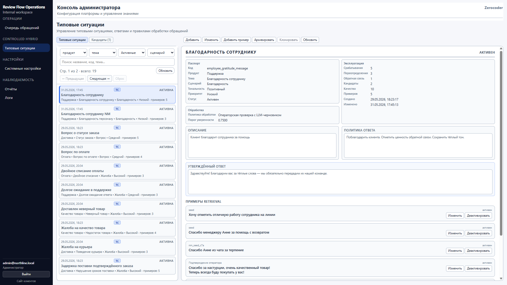

---

### 3.2. Изучить список

**Действие:** пролистайте список, при необходимости отфильтруйте по статусу (активные / все).

**Зачем:** это **база знаний** Controlled Hybrid — каждая строка = одна типовая ситуация (Response Case).

---

### 3.3. Открыть карточку

**Действие:** кликните по типовой ситуации в списке.

**Ожидается:** справа откроется детальная карточка с полями и списком примеров.

---

### 3.4. Состав типовой ситуации

| Элемент | Назначение |
|---|---|
| **Название** | Человекочитаемое имя для оператора и отчётов |
| **Код (`case_code`)** | Уникальный идентификатор в системе (латиница, подчёркивания) |
| **Направление (продукт)** | Продуктовая область: доставка, оплата, сайт и т.д. |
| **Тема** | Уточнение внутри направления (например «Задержка поставки») |
| **Сценарий / тональность / приоритет** | НСИ‑атрибуты бизнес‑классификации на уровне ТС |
| **Policy (`response_policy`)** | Правила: что можно и нельзя говорить клиенту |
| **Approved response** (`approved_response_text`) | Утверждённая основа текста ответа; LLM только адаптирует |
| **Examples** | Фразы реальных обращений — по ним retrieval подбирает эту ТС |
| **Порог уверенности** | Минимальный score для «уверенного» совпадения |
| **Политика обработки** | Например «операторская проверка с LLM‑черновиком» |

**Действия в карточке:** **«Добавить»** (новая ТС), **«Изменить»**, **«Добавить пример»**, архивирование / активация.

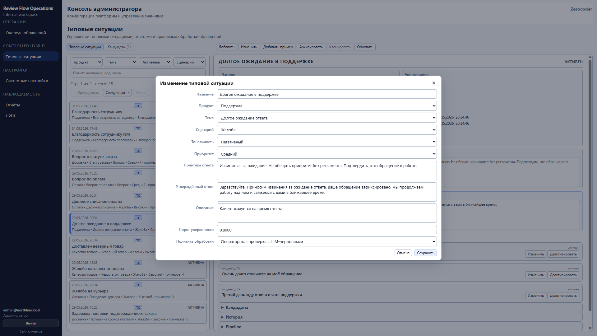

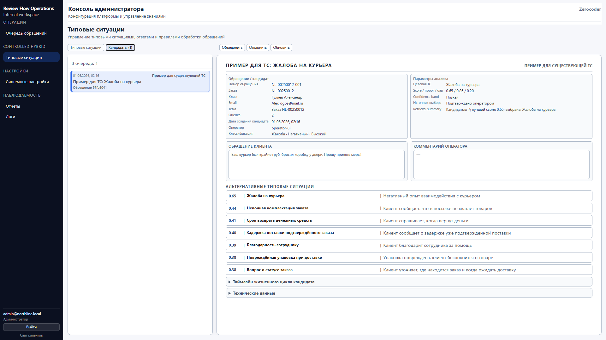

---

## 🌱 4. Обработка кандидатов

Кандидат — предложение оператора расширить базу знаний (часто после эскалации «ни одна ТС не подходит»).

### 4.1. Открыть кандидатов

**Действие:** на `/admin/response-cases` переключите вкладку **«Кандидаты (N)»**.

**Ожидается:** очередь кандидатов слева, карточка справа.

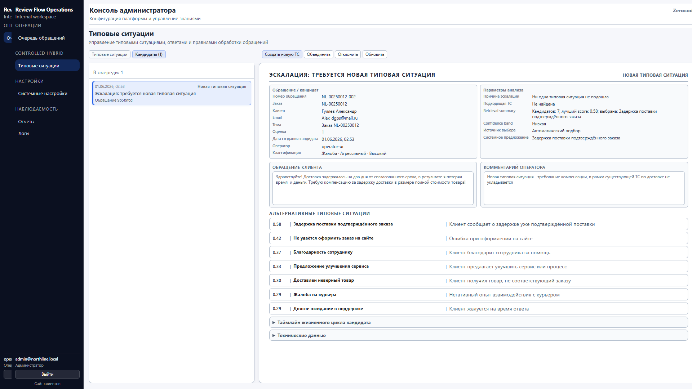

---

### 4.2. Изучить предложение

**Действие:** выберите кандидата в списке.

**Ожидается:** текст обращения клиента, причина эскалации, комментарий, предзаполненные поля для новой ТС (если есть).

---

### 4.3. Принять решение

#### A. Создать новую типовую ситуацию

**Действие:** **«Создать новую ТС»** → заполните форму (код, название, policy, approved response, НСИ) → сохраните.

**Ожидается:**

- в списке ТС появится новая запись;
- кандидат закроется;
- обращение оператора можно связать с новой ТС.

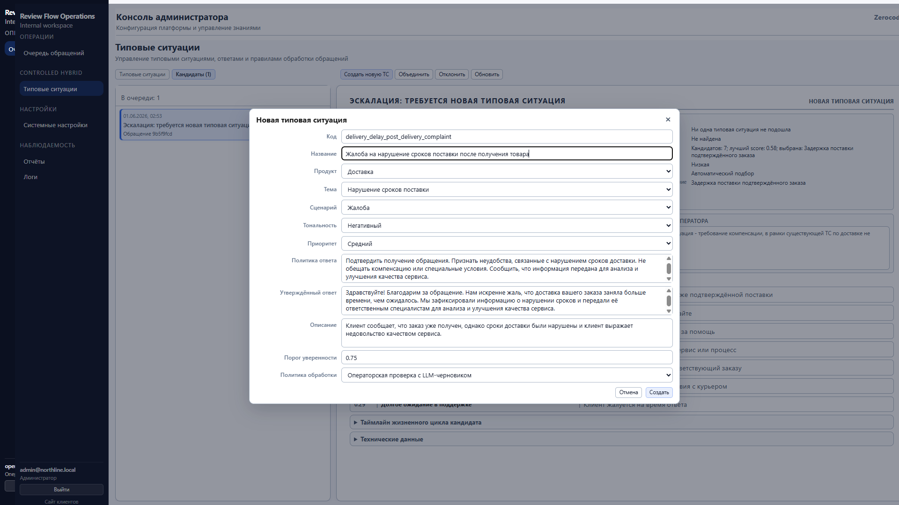

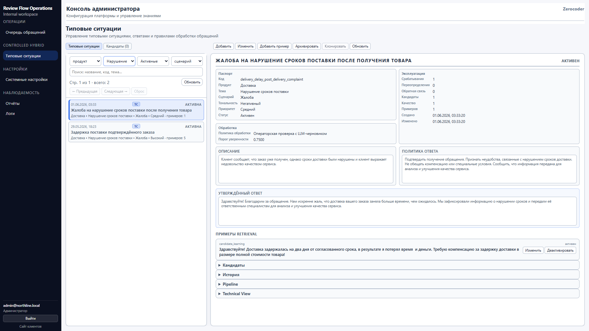

---

#### B. Присоединить к существующей

**Действие:** **«Объединить»** → выберите целевую типовую ситуацию.

**Ожидается:**

- текст обращения клиента добавится как **retrieval‑пример** к выбранной ТС;
- при следующих похожих обращениях retrieval чаще предложит эту ТС.

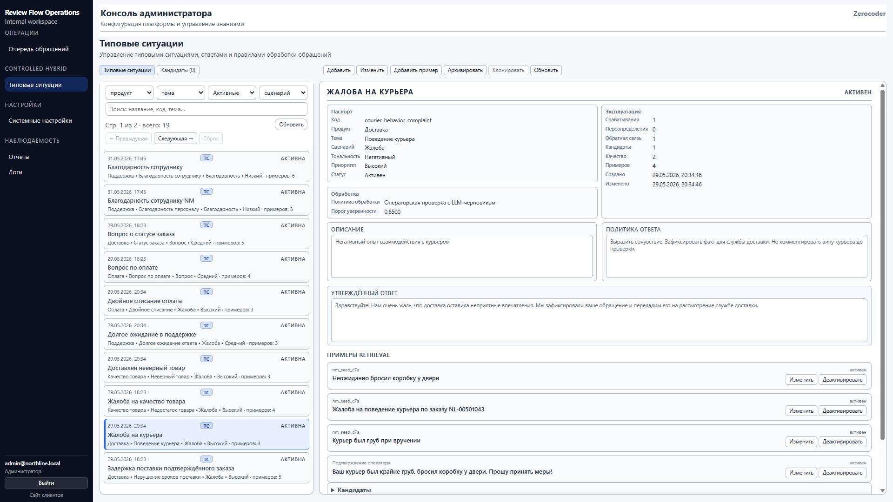

---

#### C. Отклонить

**Действие:** **«Отклонить»** → укажите комментарий (по запросу системы).

**Ожидается:** кандидат помечен отклонённым; в базу знаний изменений нет.

---

## 📊 5. Отчётность

URL: `/reports`.

**Действие:** в меню **«Наблюдаемость»** → **«Отчёты»**. Выберите вкладку отчёта, период (7 / 30 / 90 дней или свой диапазон), нажмите **«Применить»**. При необходимости экспортируйте CSV / XLSX / PDF.

### 5.1. Отчёт «Обращения клиентов»

**Что показывает:** объём обращений, сколько обработано и в работе, средняя оценка, время обработки, динамика по дням, распределения по направлению, сценарию, тональности, приоритету, топ тем.

**Зачем:** операционная картина нагрузки и тематики обращений (роль руководителя/аналитика).

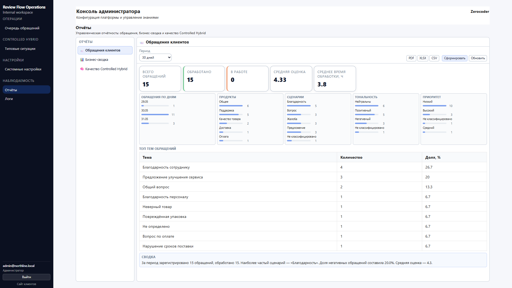

---

### 5.2. Отчёт «Бизнес-сводка»

**Что показывает:** топ **жалоб**, **благодарностей**, **предложений**, новые темы, сводный текст.

**Зачем:** увидеть повторяющиеся проблемы и идеи клиентов без чтения каждого обращения.

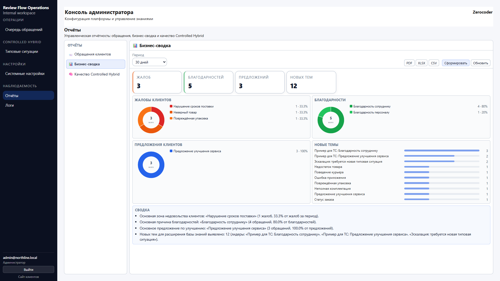

---

### 5.3. Отчёт «Качество Controlled Hybrid»

**Что показывает:** покрытие базы знаний (%), долю ручных исправлений типовой ситуации, долю низкой уверенности, число новых ТС и примеров, кандидатов, проблемные ТС по override.

**Зачем:** оценить, насколько KB и retrieval работают без постоянного вмешательства оператора.

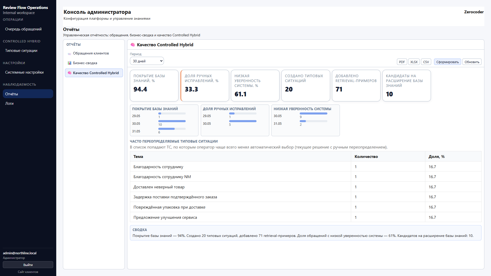

---

## ⚙️ 6. Системные настройки

URL: `/settings/system` (локально http://localhost:5180/settings/system).

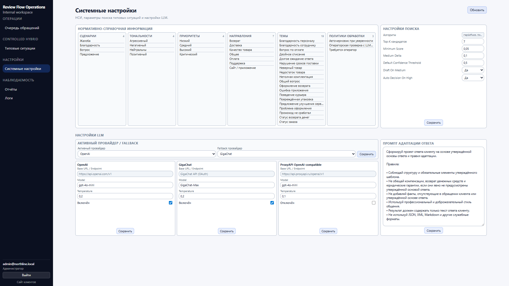

---

### 6.1. Справочники (НСИ)

Сценарии, тональности, приоритеты, направления, темы, политики обработки.

> 📌 **SOT:** справочники меняются через миграции/SQL, не через этот экран.

---

### 6.2. Параметры retrieval и confidence

| Параметр в UI | Назначение |
|---|---|
| Top-K кандидатов | Сколько альтернатив retrieval учитывает |
| Minimum Score | Минимальный score совпадения примера |
| Medium Delta | Разница score для границы «средней» уверенности |
| Default Confidence Threshold | Порог уверенности по умолчанию для ТС |
| Draft On Medium | Формировать черновик при средней уверенности |
| Auto Decision On High | Автоматическое решение при высокой уверенности |

**Действие:** измените значения → **«Сохранить»** в блоке поиска.

**Зачем:** тонкая настройка поведения Controlled Hybrid без правки кода.

---

### 6.3. AI-провайдеры

Выбор **активного** провайдера (OpenAI, GigaChat, ProxyAPI) и **fallback**. В демо часто активен **mock** — тогда черновики ответа шаблонные.

**Действие:** выберите провайдера → **«Сохранить»** в блоке маршрутизации.

Отдельная страница: `/settings/ai-providers` — детальная настройка моделей по провайдеру.

---

### 6.4. Промпт адаптации ответа

Редактирование активного системного промпта `review_response_generation` (как LLM адаптирует утверждённый текст). **«Сохранить»** создаёт новую версию в реестре промптов.

---

### 6.5. Runtime-поведение

Флаги вроде включения CH‑pipeline задаются в `.env` (`CH_PIPELINE_ENABLED`, `CH_RETRIEVAL_TOP_N` и др.) — см. [`DEPLOYMENT_GUIDE.md`](DEPLOYMENT_GUIDE.md). На экране системных настроек — параметры из БД (`/api/settings/ch-runtime`).

---

## 🛠️ 7. Типовые проблемы

| Симптом | Возможная причина | Решение |
|---|---|---|
| Ответы AI не используют новую ТС | ТС не активна / нет retrieval‑примеров | Проверьте статус ТС и добавьте примеры |
| Retrieval постоянно низкая уверенность | Мало примеров или неправильный порог | Добавьте примеры или скорректируйте `Default Confidence Threshold` |
| Очередь кандидатов растёт | Операторы эскалируют, админ не обрабатывает | Регулярно закрывайте кандидатов |
| Черновик ответа — явная заглушка | Активен **mock** провайдер | Настройте реальный AI-провайдер в `/settings/ai-providers` |

---

## 📚 Связанные документы

- [🏠 `README.md`](../README.md) — главная страница проекта и live demo.
- [🏗️ `docs/CONTROLLED_HYBRID.md`](CONTROLLED_HYBRID.md) — архитектурная модель.
- [📖 `docs/USER_GUIDE.md`](USER_GUIDE.md) — руководство клиента.
- [🔧 `docs/OPERATOR_GUIDE.md`](OPERATOR_GUIDE.md) — руководство оператора.
- [❓ `docs/FAQ.md`](FAQ.md) — ответы на частые вопросы.
- [💰 `docs/BUSINESS_VALUE.md`](BUSINESS_VALUE.md) — бизнес-ценность.
- [🎬 `docs/SYSTEM_DEMO.md`](SYSTEM_DEMO.md) — live demo и скриншоты.
- [🎬 `docs/E2E_SCENARIOS.md`](E2E_SCENARIOS.md) — сквозные бизнес-сценарии.
- [⚙️ `docs/OPERATIONS.md`](OPERATIONS.md) — эксплуатация, логи, backup, AI-провайдеры.
- [🚀 `docs/DEPLOYMENT_GUIDE.md`](DEPLOYMENT_GUIDE.md) — развёртывание и env vars.
