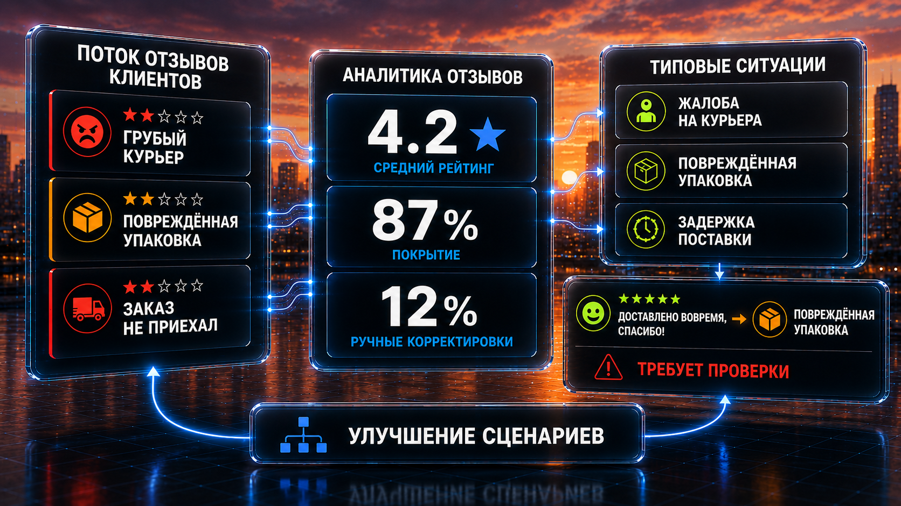
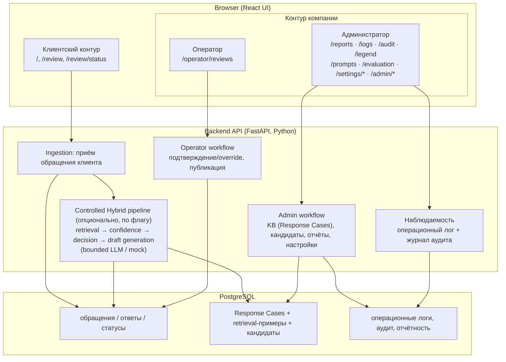
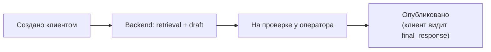
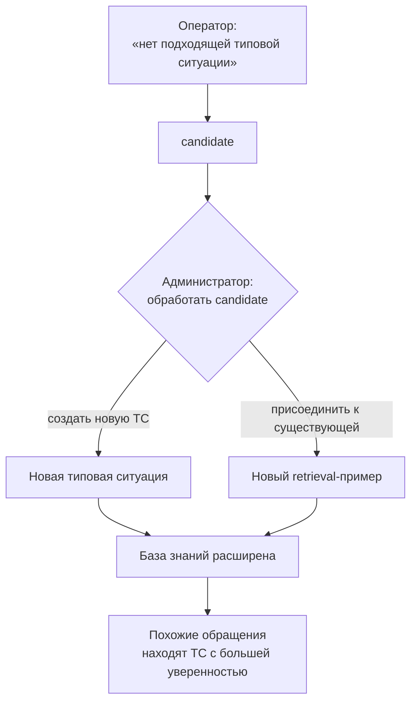

# Архитектура Review Flow

Документ описывает **реализованную архитектуру** Review Flow как демонстрационного MVP, а также отделяет:

- **as‑is (реализовано в коде)**;
- **target (описано в спецификации, но может быть не реализовано целиком)**;
- **roadmap/future work**.

Нормативный источник решений: [🧠 `docs/CONTROLLED_HYBRID.md`](CONTROLLED_HYBRID.md) и [📋 `docs/SPEC.md`](SPEC.md).

---

## 1. Общая схема системы (as‑is)

Запуск: [`docker-compose.yml`](../docker-compose.yml) поднимает `postgres`, `backend`, `frontend`.

---

## 2. Контуры и роли

### 2.1 Клиентский контур

**Назначение:** анонимный доступ клиента к созданию обращения и просмотру статуса.  
**Ключевой инвариант (Controlled Hybrid):** клиент **не видит** внутренних сущностей `Response Case`, confidence и результаты retrieval (см. [🧠 `docs/CONTROLLED_HYBRID.md`](CONTROLLED_HYBRID.md)).

Реализованные маршруты (frontend):

- `/` — главная
- `/review` — отправка обращения
- `/review/status` и `/review/status/:requestNumber` — проверка статуса и просмотр опубликованного ответа

### 2.2 Контур компании — оператор

**Назначение:** обработка очереди обращений и human‑in‑the‑loop контроль.

Реализованные сценарии (as‑is):

- очередь обращений и карточка обращения;
- просмотр предложенной типовой ситуации и confidence (в режиме Controlled Hybrid);
- редактирование текста ответа и публикация;
- эскалация через “ни одна ситуация не подходит” (создание candidate).

### 2.3 Контур компании — администратор

**Назначение:** управление знаниями и качеством.

Реализованные области (as‑is):

- отчёты: `/reports`, `/analytics`
- наблюдаемость: `/logs`, `/audit` (см. раздел 9)
- легенда обозначений: `/legend`
- промпты: `/prompts`
- evaluation: `/evaluation`
- настройки AI‑провайдеров: `/settings/ai-providers`
- системные настройки: `/settings/system`
- справочники/KB: `/admin/*` (включая `response-cases`, `ch-quality`)

### 2.4 Аутентификация и RBAC

Защита контуров реализована на двух независимых слоях (эталоны — APL-паттерны `web-ui-tokenized-demo-limiter` и `admin-console-read-only-demo-rbac`).

**Ops/admin консоль — read-only demo RBAC (`app/core/roles.py`, `app/api/auth.py`).**

- При наличии `OPS_ADMIN_TOKEN` в окружении ops-эндпоинты требуют `Authorization: Bearer <token>`. Зависимость `ops_identity` выводит роль из токена: `administrator` (`OPS_ADMIN_TOKEN`) / `operator` (`OPS_OPERATOR_TOKEN`) / `demo` (`OPS_DEMO_TOKEN`).
- Роль `demo` — **только чтение**: read-guards (`require_admin_read`, `require_ops_read`) включают `demo`; мутационные guards (`require_admin`, `require_operator`) — нет, поэтому `demo` получает `403` на любой мутации, а отказ фиксируется в операционном логе (`role_access_denied`). Backend — единственный source of truth; UI-отключение кнопок носит вспомогательный характер.
- `GET /api/auth/whoami` валидирует токен и возвращает авторитетную роль для консоли.
- **Обратная совместимость:** если `OPS_ADMIN_TOKEN` пуст (или `YOUR_*`), `ops_identity` откатывается к заголовку `X-Role` — локальная разработка и существующие тесты с `X-Role` не ломаются.

**Публичный контур — tokenized demo sessions (`app/services/demo_limiter.py`, `app/api/demo.py`).**

- При `DEMO_LIMITER_ENABLED=true` эндпоинт `POST /api/reviews` требует `X-Demo-Token`. Токен выпускается `POST /api/demo/start` и защищён тремя слоями лимита:
  1. **IP-лимит** — не более `DEMO_MAX_SESSIONS_PER_IP_PER_HOUR` сессий с одного IP в час (защита от масс-создания сессий) → `429`.
  2. **Rate-limit** — минимальный интервал `60 / DEMO_RATE_LIMIT_PER_MINUTE` секунд между запросами → `429` + `Retry-After`.
  3. **Квота** — не более `DEMO_MAX_REQUESTS_PER_SESSION` запросов на сессию с TTL `DEMO_SESSION_TTL_MINUTES` → `429` / `401`.
- Квота списывается на этапе валидации токена (до запуска AI-пайплайна), поэтому ошибочный payload не возвращает квоту. Дешёвые GET status/detail остаются открытыми. Созданные в demo-режиме отзывы помечаются `demo_mode=true` (модель `reviews`, миграция `016`).

---

## 3. Backend API (as‑is)

Backend — FastAPI приложение (`backend/app/main.py`), использует PostgreSQL и хранит доменные сущности в БД.

### 3.1 Примеры ключевых API (не полный список)

- **Клиентский сценарий**:
  - `POST /api/reviews` — создать обращение
  - `GET /api/reviews/requests/{request_number}/status?email=...` — получить статус по номеру и email
- **Оператор**:
  - `GET /api/operator/reviews` — очередь
  - действия по модерации/публикации и Controlled Hybrid решениям (confirm/override/candidate) — см. реализацию в `backend/app/api/operator.py` и сервисах `backend/app/services/controlled_hybrid/*`
- **Администратор**:
  - CRUD и управление типовыми ситуациями: `GET/POST /api/admin/response-cases...`
  - отчётность: `/api/admin/reports...`
  - настройки: `/api/settings/*`

Точный контракт API см. в [🔌 `docs/API_CONTRACT.md`](API_CONTRACT.md) или OpenAPI по адресу `/docs` backend.

---

## 4. PostgreSQL и миграции (as‑is)

### 4.1 Инициализация БД в Docker Compose

`docker-compose.yml` монтирует SQL‑файлы в `postgres` контейнер как `docker-entrypoint-initdb.d/*`. Эти файлы применяются **только на первом старте** нового volume:

- `infra/db/migrations/001_initial_schema.sql`
- `infra/db/migrations/002_seed_data.sql`
- `infra/db/migrations/003_milestone4_prompt_registry.sql`
- `infra/db/migrations/004_milestone5_observability_metadata.sql`

### 4.2 Применение миграций backend (as‑is)

Backend при старте выполняет `run_pending_migrations()` и применяет SQL‑миграции из `backend/migrations/*.sql`, записывая версию в таблицу `schema_migrations`.

Это позволяет донакатывать изменения поверх уже созданной БД без ручного запуска SQL.

---

## 5. Controlled Hybrid pipeline (as‑is + норматив)

Семантика Controlled Hybrid (важно):

- **retrieval** подбирает наиболее подходящую типовую ситуацию (`Response Case`) по примерам;
- система вычисляет **confidence** на основе результатов retrieval;
- **LLM не принимает бизнес‑решение** и не “выбирает” ситуацию;
- LLM (или mock‑провайдер) используется для **адаптации текста** в рамках `response_policy` и `approved_response_text`;
- оператор подтверждает или меняет решение, а при отсутствии подходящей ситуации запускает learning loop через candidate.

Нормативное описание: [🧠 `docs/CONTROLLED_HYBRID.md`](CONTROLLED_HYBRID.md).

### 5.1 Переключение режима

Поведение pipeline определяется флагом окружения:

- `CH_PIPELINE_ENABLED=true` — Controlled Hybrid pipeline
- `CH_PIPELINE_ENABLED=false` — legacy‑режим (для сравнения/регрессии)

См. `.env.example`.

---

## 6. Lifecycle обращения (as‑is)

Упрощённый цикл жизни обращения:

Детальная семантика статусов для клиентского UX описана в [📖 `docs/USER_GUIDE.md`](USER_GUIDE.md) и [🧠 `docs/CONTROLLED_HYBRID.md`](CONTROLLED_HYBRID.md).

---

## 7. Lifecycle новой типовой ситуации (learning loop)

Реализованный демонстрационный цикл (в терминах UI):

---

## 8. Роли retrieval / LLM / оператора / администратора

- **Retrieval**: поиск похожих примеров и ранжирование типовых ситуаций.
- **LLM**: адаптация текста ответа (bounded generation) в рамках утверждённой политики; в демо может работать `mock`‑провайдер.
- **Оператор**: финальная инстанция по решению и публикации; источник корректировок и кандидатов.
- **Администратор**: владелец базы знаний (Response Cases, примеры, кандидаты), отвечает за качество и эволюцию KB.

---

## 9. Наблюдаемость (as‑is)

Группа «Наблюдаемость» консоли компании — два раздельных журнала (канон референса AIC: список слева ↔ детализация справа, фильтры, пагинация, CSV-экспорт):

- **`/logs` — «Логи»**: трейсы обработки обращений. Одна строка списка = одно обращение (время, статус, номер, модель, latency); детализация — «Параметры запроса/исполнения», «Запрос пользователя» → «Ответ системы», «Ошибка», таймлайн pipeline (этапы с JSON payload), технический снимок. Данные — операционный лог пайплайна (`operational_log`), тексты обращения/ответа читаются по ссылке, а не дублируются.
- **`/audit` — «Журнал аудита»**: пользовательская активность персонала, клиентов и демо-режима. Пишется сервисом `audit_service` в таблицу `audit_logs` (миграции `018`/`019` — монотонный seq number); события мутаций персонала (`response_case_*`, `prompt_version_*`, …) и клиентского контура (`review_submitted`, `review_status_checked`, `demo_session_started`) фиксируются с IP-адресом. Read-операции консоли в аудит не попадают.
- Оба журнала выгружаются в CSV (UTF-8 BOM) с текущими фильтрами.
- Экран «Обозначений» (`/legend`) — легенда эмодзи-контракта чипов и статусов консоли.

Контракт API: [🔌 `docs/API_CONTRACT.md`](API_CONTRACT.md) (разделы Logs и Audit).

---

## 10. Ограничения MVP (as‑is)

- UI контуры реализованы как одно приложение с role‑переключением.
- Возможен `mock`‑провайдер AI, который **не является LLM** и возвращает шаблонный текст (см. [🔌 `docs/API_CONTRACT.md`](API_CONTRACT.md) раздел AI Provider Settings).
- Содержимое KB и справочников — демонстрационные seed‑данные.

---

## 11. Roadmap / future work (строго как планы)

Ниже — направления, которые в документах помечены как целевые, но не обязательно реализованы целиком в текущем MVP:

- визуальное разделение client site и company workspace;
- усиление контракта “operational console” (AF‑alignment) для рабочих мест (семантическое выравнивание);
- развитие аналитики качества Controlled Hybrid (ошибки retrieval, частые override, coverage KB).
