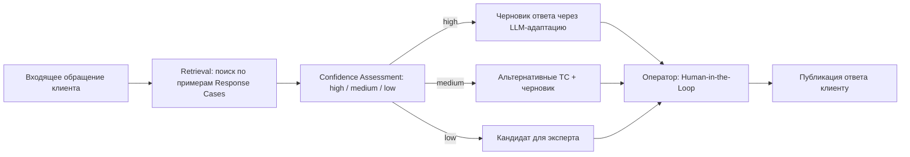
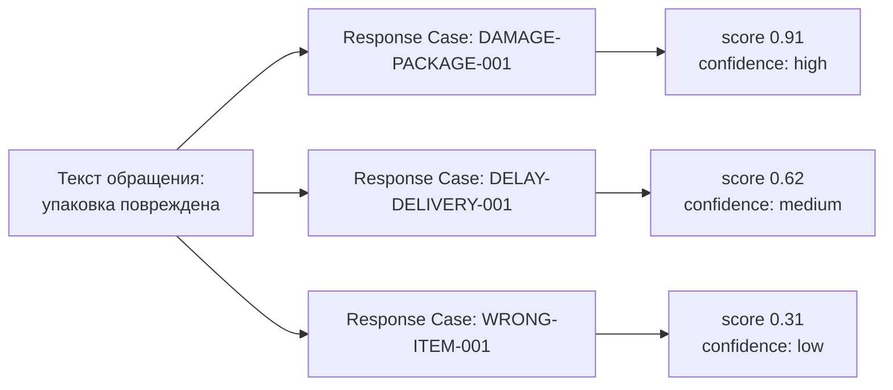
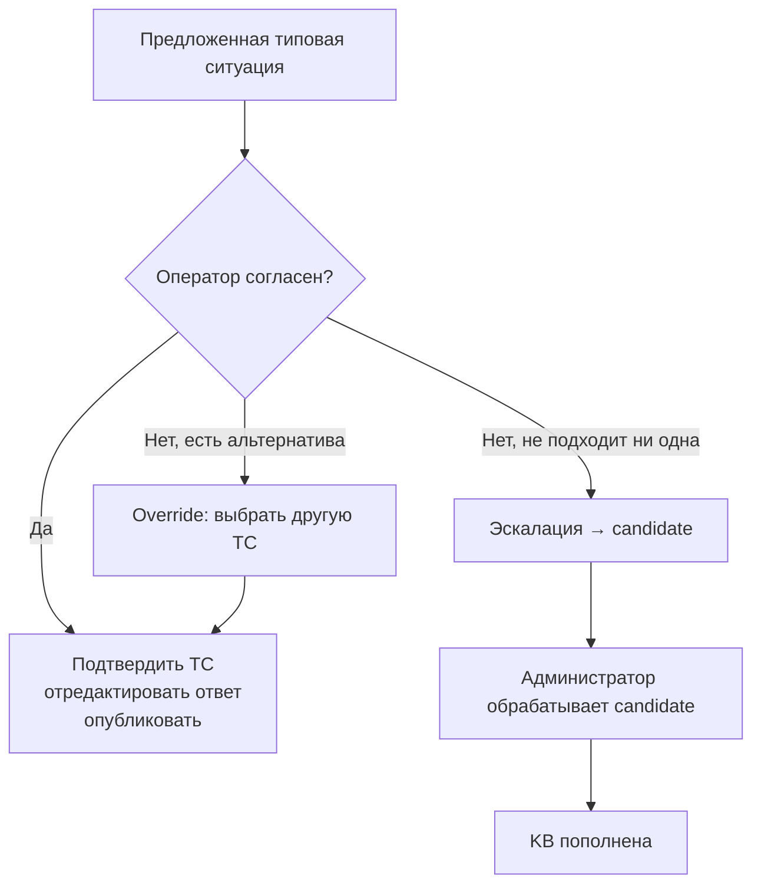

# Controlled Hybrid в Review Flow

Этот документ объясняет подход **Controlled Hybrid** в терминах Review Flow и фиксирует корректную семантику:

- **retrieval** подбирает наиболее подходящую типовую ситуацию (Response Case) по примерам;
- система вычисляет **confidence** на базе retrieval‑ранжирования;
- **LLM не выбирает типовую ситуацию** и не принимает бизнес‑решение;
- LLM используется для **адаптации текста** в рамках утверждённой политики ответа;
- оператор остаётся **Human‑in‑the‑Loop** контролем;
- администратор развивает базу знаний через кандидатов и новые типовые ситуации.

Нормативные источники:

- [🏗️ `docs/ARCHITECTURE.md`](ARCHITECTURE.md) — реализованная архитектура.

---

## 1. Что такое Controlled Hybrid в контексте Review Flow

**Controlled Hybrid** — это архитектура обработки обращений, где:

- **типовая ситуация (Response Case)** является **Source of Truth** бизнес‑решения;
- решение выбирается через **retrieval** по базе типовых ситуаций и их примерам;
- LLM подключается только как инструмент **языковой адаптации** (переформулирование) в рамках заранее утверждённой политики ответа.

### Общий pipeline



---

## 2. Почему не выбран LLM‑first

Подход LLM‑first делает бизнес‑решение зависимым от поведения модели и промпта, что усложняет:

- предсказуемость;
- аудит;
- воспроизводимость;
- контроль качества на уровне “правильного решения”, а не “красивого текста”.

### Сравнение подходов

```mermaid
flowchart TB
    subgraph "LLM-first"
        L1["Обращение клиента"] --> L2["LLM выбирает сценарий, тональность, приоритет и пишет ответ"]
        L2 --> L3["Решение не фиксировано в артефакте KB"]
    end

    subgraph "Controlled Hybrid"
        C1["Обращение клиента"] --> C2["Retrieval: Response Case из KB"]
        C2 --> C3["Confidence Assessment"]
        C3 --> C4["LLM адаптирует утверждённый текст"]
        C4 --> C5["Оператор проверяет и публикует"]
        C5 --> C6["Решение фиксировано в Response Case"]
    end

    subgraph "Полный RAG"
        R1["Обращение клиента"] --> R2["Retrieval по документам"]
        R2 --> R3["LLM генерирует ответ из документов"]
        R3 --> R4["Бизнес-решение в неявных документах"]
    end
```



| Аспект | LLM-first | Полный RAG | Controlled Hybrid |
|--------|-----------|------------|-------------------|
| Source of Truth бизнес-решения | промпт + модель | документы | Response Case в KB |
| Предсказуемость | низкая | средняя | высокая |
| Аудит решений | сложно | частично | прямой: case_id, confidence, override |
| Контроль оператора | минимальный | минимальный | Human-in-the-Loop |
| Сложность внедрения | низкая | высокая | средняя |

Обоснование сравнений вариантов (в т.ч. по структуре затрат и рискам) — см. [🏗️ `docs/ARCHITECTURE.md`](ARCHITECTURE.md) раздел "Почему не LLM-first и не полный RAG".

---

## 3. Почему не выбран “полный RAG” как основной контур

Полный RAG (документы → retrieval → LLM) увеличивает технологическую сложность и переносит значимую часть бизнес‑контекста в “неявные” документы.

В Review Flow ключевой объект управления — **типовая ситуация** с явно заданной политикой ответа и жизненным циклом. Это лучше подходит для операционного контроля и “учебного” MVP, где важна прозрачность решений.

---

## 4. Почему Response Case является Source of Truth

Response Case (типовая ситуация) фиксирует:

- атрибуты случая (сценарий/тональность/приоритет/направление/тема — как справочные атрибуты);
- **response_policy**: правила и ограничения ответа;
- **approved_response_text**: утверждённая основа текста;
- пороги уверенности (например, `confidence_threshold`).

Таким образом, бизнес‑решение становится управляемым артефактом базы знаний, а не результатом “свободной” генерации.

---

## 5. Как работает retrieval‑подбор типовой ситуации

В терминах “чёрного ящика” (без привязки к конкретной векторной БД):

1. Система берёт текст обращения и контекст (если есть).
2. Retrieval ищет наиболее похожие **примеры** типовых ситуаций.
3. Формируется ранжированный список кандидатов (Top‑N).
4. Top‑1 используется как “предложенная типовая ситуация”, а score — как основание для confidence.

Важно: retrieval — это **поиск и ранжирование**, а не LLM.

### Пример ранжирования



---

## 6. Как используется confidence

Confidence — это качественная оценка уверенности системы в том, что выбранная типовая ситуация подходит (high/medium/low). Она вычисляется системой полностью арифметически — **LLM в оценке не участвует**.

> **Калибровка (v2, 31.08.2026).** Лексический score (`token_set_ratio`) не является вероятностной мерой: разговорное обращение vs формулировка примера дают ~0.6 при заведомо правильном выборе, а пороги 0.75–0.85 правильные выборы не берут никогда. Band вычисляется из трёх величин:
>
> - **`score_floor`** (по умолчанию 0.45) — ниже него совпадение мусорное (low) независимо от отрыва;
> - **`match_gap`** — отрыв top-1 от второго кандидата: явный отрыв ≥ `confidence_gap_high` (по умолчанию 0.10) означает, что выбор однозначен (high), даже если абсолютный score умеренный;
> - **`confidence_threshold`** (дефолт 0.60, перекалиброван по диапазону подтверждённых оператором выборов 0.48–0.71) — абсолютный self-sufficient путь в high.
>
> Итог: high = `score ≥ threshold` **или** (`gap ≥ gap_high` при `score ≥ floor`); low = `score < floor` (или ниже medium-зоны при плотной гонке); medium = всё остальное.
>
> Важно: band — только качественная оценка. **Обращение в любом случае попадает оператору на подтверждение** (`auto_decision_on_high=false`): оператор подтверждает выбранную ТС, переопределяет или эскалирует.

В UI оператор видит:

- значение/уровень confidence (high/medium/low);
- альтернативные типовые ситуации (Top‑N).

Скриншот примера “низкая уверенность + альтернативы”:  
[oper-rev-low.png](screenshots/oper-rev-low.png)

---

## 7. Human‑in‑the‑Loop: как оператор контролирует решение

Оператор работает не с “классификацией LLM”, а с предложенной типовой ситуацией:

- подтверждает выбранную типовую ситуацию, если согласен;
- выбирает альтернативную (override), если не согласен;
- эскалирует случай, если **нет подходящей ситуации**, запуская learning loop через candidate.



---

## 8. Candidate Learning: как работает learning loop

Learning loop — это процесс пополнения базы знаний через реальные кейсы.


Шаги в системе:

1. Клиент создаёт обращение.
2. Retrieval предлагает неподходящую или недостаточно уверенную типовую ситуацию.
3. Оператор фиксирует: «ни одна типовая ситуация не подходит», создаёт **candidate**.
4. Администратор обрабатывает кандидата: создаёт новую типовую ситуацию или присоединяет к существующей.
5. Обращение-кандидат становится **retrieval-примером**.
6. Следующее похожее обращение распознаётся с **высокой уверенностью** — без смены бизнес-логики «вручную» на каждый раз.

Скриншоты шагов:

- оператор инициирует сценарий для новой ТС: [oper-rev-for-newTS.png](screenshots/oper-rev-for-newTS.png)
- оператор заполняет комментарий/описание: [oper-comment-for-newTS.png](screenshots/oper-comment-for-newTS.png)
- администратор видит нового кандидата: [adm-ts-cand-new.png](screenshots/adm-ts-cand-new.png)
- администратор создаёт новую типовую ситуацию: [adm-ts-new-create.png](screenshots/adm-ts-new-create.png)
- созданная типовая ситуация: [adm-ts-new-created.png](screenshots/adm-ts-new-created.png)
- пример candidate добавлен как retrieval‑пример: [adm-ts-after-add-cand-sample.png](screenshots/adm-ts-after-add-cand-sample.png)

---

## 9. Как администратор расширяет базу знаний

Администратор отвечает за качество и развитие KB:

- создаёт и редактирует Response Cases;
- управляет примерами (retrieval‑примерами);
- обрабатывает кандидатов:
  - создаёт новую типовую ситуацию, либо
  - присоединяет candidate к существующей ситуации (как новый retrieval‑пример).

Скриншот списка типовых ситуаций: [adm-ts-list.png](screenshots/adm-ts-list.png).

---

## 10. Как новая типовая ситуация начинает использоваться в последующих обращениях

После того как типовая ситуация создана и связана с примерами:

- новые похожие обращения попадают в retrieval‑поиск;
- типовая ситуация начинает появляться в top‑N и (при достаточном score) становится top‑1;
- confidence увеличивается за счёт лучшей близости к примерам;
- оператор всё ещё остаётся точкой контроля в спорных случаях.

---

## 11. Системный промпт адаптации ответа

На этапе «LLM адаптирует утверждённый текст» поведение модели определяет **системный промпт** (`generation_mode: case_policy_adaptation`).

### Источник промпта

**Единственный Source of Truth — активная версия промпта в системных настройках** (панель «Промпт адаптации ответа», ключ реестра `review_response_generation`). Встроенный текст в коде (`BOUNDED_SYSTEM_PROMPT` в `draft_generation.py`) — только fallback на случай пустого реестра.

- Редактирование: «Системные настройки» → «Промпт адаптации ответа» → «Сохранить» (см. [📘 `docs/ADMIN_GUIDE.md`](ADMIN_GUIDE.md)).
- Каждое сохранение создаёт **новую версию** в реестре `prompt_versions` и активирует её; активная версия отображается в панели (бейдж `vN`).
- Смена версий фиксируется в журнале аудита: `prompt_version_created`, `prompt_version_activated`.

### Активный промпт (v2)

```text
Ты адаптируешь заранее утверждённый ответ компании под конкретное обращение клиента.

Правила:
1. Используй утверждённый текст ответа как фактическую и тональную основу.
2. Строго следуй политике ответа.
3. Не выдумывай процедуры, каналы, сроки, суммы и любые факты, которых нет в утверждённом тексте или политике.
4. Если какой-то детали нет (ссылка, срок, сумма) — просто опусти её. Никогда не оставляй заглушки вида [укажите актуальную ссылку].
5. Не обещай компенсации и юридические гарантии.
6. Пиши профессионально, вежливо и по делу, на русском языке.
7. Выведи только итоговое сообщение клиенту, обычным текстом, без JSON и служебных пометок.
```

Ключевые анти-галлюцинационные правила — п. 3–4: утверждённый текст ТС и `response_policy` — единственный источник фактов; отсутствующая деталь опускается, а не заменяется заглушкой.

### Урок v1 (почему промпт переписан)

Первая версия промпта была написана для legacy-шаблонного режима и упоминала несуществующие в CH-режиме поля (`template_text`, `required/forbidden elements`). На E2E-тесте (обращение с темой «возврат», правильный матч ТС и band `medium`) модель «дописывала» процедуру возврата из общих соображений (каналы, шаги проверки) и вставляла заглушку `[укажите актуальную ссылку]` — при том что политика требует давать ссылку только «при наличии». После замены на v2 (тест 4, то же обращение) черновик стал опираться на утверждённую основу и политику. Вывод: промпт должен соответствовать режиму пайплайна, для которого он активен.

---

## Примечание о реализованном состоянии

В репозитории присутствуют материалы, которые различают **реализованное поведение** и **целевую архитектуру**. Если нужен “фактический” разбор pipeline и поведения mock‑провайдера, см. [🔍 `docs/API_CONTRACT.md`](API_CONTRACT.md) раздел Evaluation и CH Analytics.

