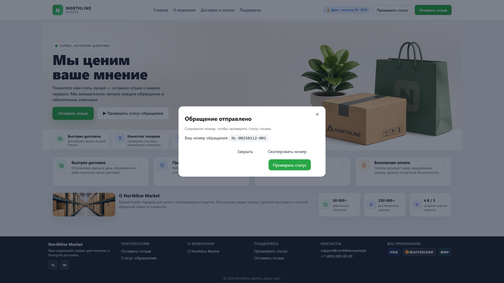
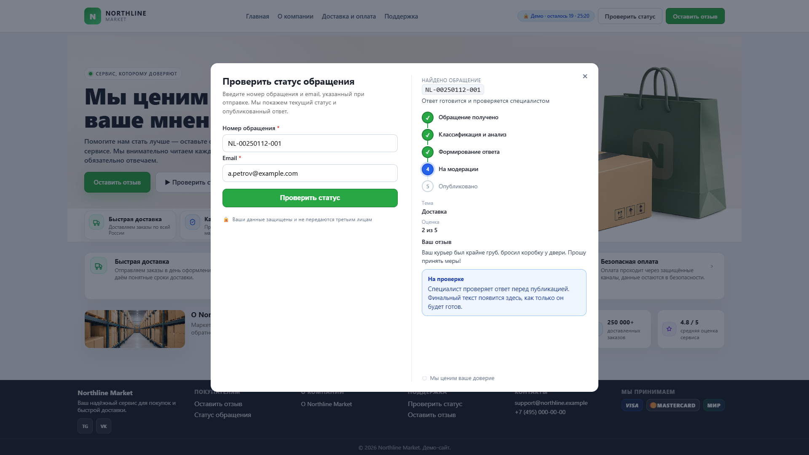
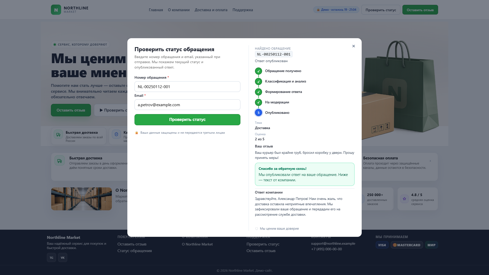
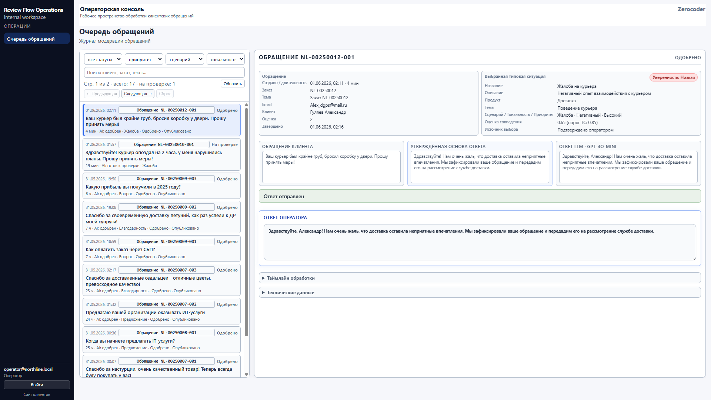
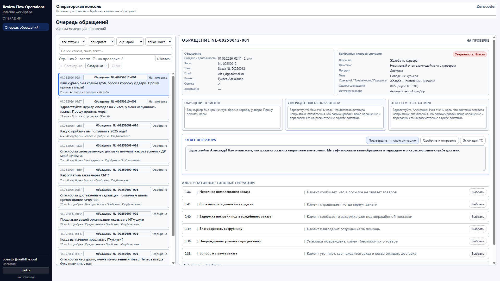
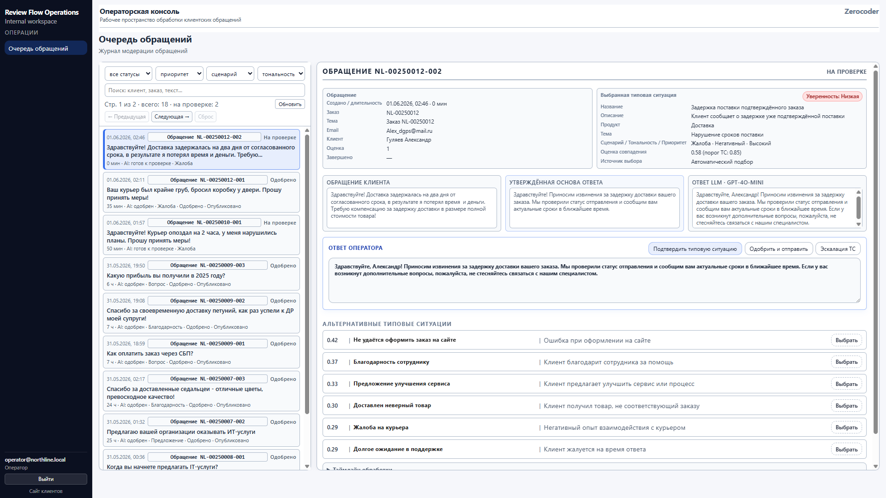
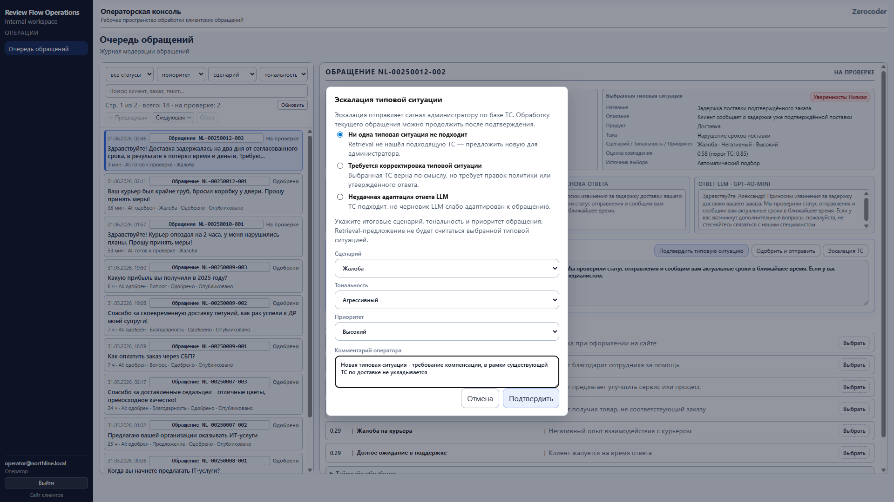

# 🎬 Review Flow — сквозные бизнес-сценарии

**Проект:** review-flow  
**Дата:** 2026-08-09

---

## 🛍️ 1. Клиент создаёт обращение

**Участники:** клиент, публичный Web UI Review Flow.

**Цель:** оставить отзыв, жалобу, предложение или вопрос и получить номер для отслеживания.

**Шаги:**

1. Клиент открывает [▶️ веб-интерфейс клиента](https://review-flow.alex-n8n.site).
2. На главной странице нажимает **«Оставить отзыв»**.
3. Заполняет форму:
   - номер заказа/сделки;
   - тему (продуктовая область);
   - текст обращения;
   - email для проверки статуса;
   - имя и оценку (опционально).
4. Backend принимает обращение, сохраняет его в PostgreSQL и запускает Controlled Hybrid pipeline.
5. Система возвращает клиенту отображаемый номер обращения (`NL-…`).
6. Клиент сохраняет номер и email.

**Ожидаемый результат:** обращение создано, клиент получил номер `NL-…`.

**Скриншоты:**

*Клиент заполняет форму обращения.*

*Подтверждение отправки и выдача номера обращения.*

---

## 🔍 2. Клиент проверяет статус и читает ответ

**Участники:** клиент, публичный Web UI Review Flow.

**Цель:** узнать, в какой стадии обращение, и прочитать опубликованный ответ.

**Шаги:**

1. Клиент открывает главную страницу и нажимает **«Проверить статус обращения»**.
2. Вводит номер обращения и email.
3. Backend проверяет владельца обращения и возвращает клиентский статус.
4. Клиент видит понятные этапы: «обрабатываем», «на проверке», «опубликован ответ».
5. После публикации оператором клиент видит финальный текст ответа.

**Ожидаемый результат:** клиент видит текущий этап или опубликованный ответ без внутренних терминов.

**Скриншоты:**

*Клиент проверяет статус по номеру и email.*

*Опубликованный ответ доступен клиенту.*

---

## 🔧 3. Оператор обрабатывает обычное обращение

**Участники:** оператор, консоль Review Flow.

**Цель:** проверить предложенное решение, отредактировать ответ и опубликовать его.

**Шаги:**

1. Оператор открывает https://review-flow-admin.alex-n8n.site/company и входит по Bearer-токену `OPS_OPERATOR_TOKEN`.
2. Открывает очередь обращений `/operator/reviews`.
3. Выбирает обращение из списка — справа загружается карточка.
4. Видит:
   - текст обращения клиента;
   - предложенную типовую ситуацию (Response Case);
   - уровень confidence (Высокая / Средняя / Низкая);
   - альтернативные типовые ситуации (Top-N), если уверенность не высокая;
   - черновик ответа, собранный из policy и утверждённого текста ТС с адаптацией LLM.
5. При несогласии с предложением выбирает подходящую альтернативу.
6. Подтверждает типовую ситуацию (если требуется).
7. Редактирует текст ответа в поле **«Ответ оператора»**.
8. Нажимает **«Одобрить и отправить»** — ответ публикуется.

**Ожидаемый результат:** ответ опубликован; клиент видит его на странице статуса.

**Скриншоты:**

*Карточка обращения: оператор редактирует финальный ответ.*

*Низкая уверенность и альтернативные типовые ситуации.*

---

## 🚨 4. Оператор эскалирует обращение в базу знаний

**Участники:** оператор, администратор (на следующем шаге).

**Цель:** сигнализировать, что в KB нет подходящей типовой ситуации, и запустить learning loop.

**Шаги:**

1. Оператор открывает обращение, для которого retrieval и альтернативы не покрывают кейс.
2. Нажимает **«Эскалация ТС»**.
3. Выбирает вариант **«Ни одна типовая ситуация не подходит»**.
4. Указывает сценарий, тональность, приоритет.
5. Описывает ситуацию в комментарии (обязательно).
6. Подтверждает эскалацию.
7. Backend создаёт кандидата для администратора.
8. Оператор может вручную отредактировать ответ и опубликовать его клиенту, не оставляя клиента без ответа.

**Ожидаемый результат:** создан кандидат; клиент получил ответ; администратор видит кандидата в очереди.

**Скриншоты:**

*Оператор инициирует эскалацию «нет подходящей ТС».*

*Оператор описывает ситуацию и запускает learning loop.*

---

## 🎛️ 5. Администратор обрабатывает кандидата и расширяет базу знаний

**Участники:** администратор, консоль администратора Review Flow.

**Цель:** превратить операционный сигнал оператора в новое знание.

**Шаги:**

1. Администратор открывает https://review-flow-admin.alex-n8n.site/company и входит по Bearer-токену `OPS_ADMIN_TOKEN`.
2. Переходит в **Controlled Hybrid → Типовые ситуации** → вкладка **«Кандидаты»**.
3. Видит нового кандидата с контекстом обращения и комментарием оператора.
4. Принимает одно из решений:
   - **Создать новую типовую ситуацию** — заполняет форму (код, название, policy, approved response, НСИ) и сохраняет.
   - **Объединить с существующей** — выбирает целевую ТС; текст обращения становится retrieval-примером.
   - **Отклонить** — указывает комментарий, в базу знаний изменений не вносит.
5. После одобрения кандидат становится retrieval-примером.
6. Последующие похожие обращения распознаются с более высокой уверенностью.

**Ожидаемый результат:** база знаний пополнена; похожие обращения обрабатываются быстрее и увереннее.

**Скриншоты:**

*Кандидат от оператора в очереди администратора.*

*Администратор создаёт новую типовую ситуацию из кандидата.*

*Новая Response Case добавлена в базу знаний.*

*Текст обращения стал retrieval-примером существующей ТС.*

---

## 📊 6. Руководитель смотрит отчёты

**Участники:** руководитель / аналитик, консоль администратора Review Flow.

**Цель:** понять нагрузку, тематику и качество обработки обращений.

**Шаги:**

1. Пользователь открывает `/reports` после входа администратора.
2. Выбирает период: сегодня, 7/30/90 дней или произвольный диапазон.
3. Просматривает отчёты:
   - **Обращения клиентов** — объём, обработка, средний рейтинг, динамика, распределения.
   - **Бизнес-сводка** — топ жалоб, предложений, благодарностей, новые темы.
   - **Качество Controlled Hybrid** — coverage, override rate, low confidence rate, проблемные ТС.
4. При необходимости экспортирует отчёт в CSV, XLSX или PDF.

**Ожидаемый результат:** руководитель видит операционную картину и точки роста базы знаний.

**Скриншоты:**

*Отчёт по обращениям: объём, рейтинг, динамика.*

*Бизнес-сводка: топ тем и новые темы.*

*Качество Controlled Hybrid: coverage, override, low confidence.*

---

## 📚 Связанные документы

- [🏠 `README.md`](../README.md) — главная страница проекта и live demo.
- [🎬 `docs/SYSTEM_DEMO.md`](SYSTEM_DEMO.md) — скриншоты и live demo.
- [📈 `docs/BUSINESS_VALUE.md`](BUSINESS_VALUE.md) — бизнес-ценность.
- [📖 `docs/USER_GUIDE.md`](USER_GUIDE.md) — руководство клиента.
- [🔧 `docs/OPERATOR_GUIDE.md`](OPERATOR_GUIDE.md) — руководство оператора.
- [🎛️ `docs/ADMIN_GUIDE.md`](ADMIN_GUIDE.md) — руководство администратора.
- [❓ `docs/FAQ.md`](FAQ.md) — ответы на частые вопросы.
