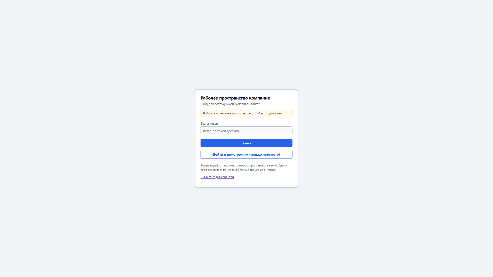

# 🔧 Review Flow — руководство оператора

**Проект:** review-flow  
**Дата:** 2026-08-09

🌐 **Консоль оператора:** [▶️ Открыть рабочее место оператора](https://review-flow-admin.alex-n8n.site/company)

---

## 🎯 1. Назначение

Это руководство для **оператора Review Flow** — сотрудника линии поддержки, который:

- проверяет входящие обращения;
- подтверждает или меняет предложенную типовую ситуацию;
- редактирует и **публикует** ответ клиенту;
- при необходимости эскалирует ситуацию в базу знаний.

Оператор — точка **Human-in-the-Loop** в Controlled Hybrid. Финальную ответственность за ответ несёт оператор, не языковая модель.

---

## 🔐 2. Вход в рабочее место

### 2.1. Открыть контур компании

**Действие:** откройте https://review-flow-admin.alex-n8n.site/company (локально — http://localhost:5180/company).

**Зачем:** отделить публичный сайт от рабочих инструментов сотрудников.

---

### 2.2. Войти под ролью оператора

| Роль | Токен |
|---|---|
| Оператор | `OPS_OPERATOR_TOKEN` (локально `dev-operator-token`) |
| Демо (только просмотр) | `VITE_OPS_DEMO_TOKEN` (локально `dev-demo-token`) — кнопка «Войти в демо-режим (только просмотр)» |

**Действие:** вставьте ops-токен в поле «Bearer токен» и нажмите **«Войти»**.

**Ожидается:** переход в рабочую область `/operator/reviews` без ошибки авторизации.

> 🔒 **Read-only demo:** роль `demo` открывает очередь и карточки в режиме **только просмотр** — действия (одобрить, отклонить, подтвердить ситуацию, эскалация) отключены. Backend всё равно отклоняет любую мутацию с `403`, поэтому обход UI невозможен.

---

## 📋 3. Очередь обращений

### 3.1. Открыть очередь

**Действие:** после входа откроется **очередь обращений** (список слева).

**Зачем:** здесь все обращения, ожидающие проверки и публикации.

**Ожидается:** список карточек с номером, клиентом, статусом модерации. Используйте поиск и фильтры над списком.

---

### 3.2. Выбрать обращение

**Действие:** кликните по строке в списке слева.

**Ожидается:** справа загрузится **карточка обращения** (если загрузка долгая — кратко «Загрузка обращения…»).

---

## 🧠 4. Проверка Controlled Hybrid

### 4.1. Прочитать обращение клиента

**Действие:** в блоке **«Обращение клиента»** прочитайте исходный текст, оценку, данные заказа и email.

**Зачем:** понять контекст до принятия решения по типовой ситуации и ответу.

---

### 4.2. Посмотреть предложенную типовую ситуацию

Вверху карточки блок **«Выбранная типовая ситуация»** показывает:

- **название** и описание;
- **направление (продукт)** и **тема**;
- сценарий, тональность, приоритет;
- **оценку совпадения** (score retrieval);
- **источник выбора** (система предложила / оператор изменил).

**Зачем:** система подобрала ТС по похожим **retrieval‑примерам** из базы знаний; оператор проверяет, подходит ли предложение.

---

### 4.3. Оценить уверенность

Рядом с заголовком блока ТС — метка **«Уверенность: Высокая / Средняя / Низкая»**.

| Уровень | Как интерпретировать |
|---|---|
| **Высокая** | Retrieval уверенно совпал с одной ТС — чаще достаточно подтвердить и опубликовать |
| **Средняя** | Есть сомнения — внимательно проверьте текст и альтернативы |
| **Низкая** | Высокий риск ошибки — обычно нужен выбор другой ТС или эскалация |

---

### 4.4. Выбрать альтернативу

Если уверенность не высокая, ниже появится список **«Альтернативные типовые ситуации»** с оценкой и кнопкой **«Выбрать»**.

**Действие:** при несогласии с основным предложением нажмите **«Выбрать»** у подходящей альтернативы.

**Ожидается:** карточка обновится — выбранная ТС станет текущей, черновик ответа может пересчитаться.

---

### 4.5. Проверить черновик ответа

**Действие:** прочитайте блок **«Ответ AI»** — это черновик, собранный из политики и утверждённого текста выбранной ТС с адаптацией LLM.

**Зачем:** убедиться, что формулировки уместны; при демо‑провайдере **mock** текст может быть шаблонной заглушкой.

---

## ✏️ 5. Публикация ответа

### 5.1. Подтвердить типовую ситуацию

Пока поле **«Ответ оператора»** заблокировано, нажмите **«Подтвердить типовую ситуацию»**.

**Ожидается:** разблокируется редактирование финального текста.

Если вы уже сменили ТС через **«Выбрать»** в альтернативах, шаг может выполняться автоматически — ориентируйтесь на подсказку в поле ответа.

---

### 5.2. Отредактировать ответ

**Действие:** в блоке **«Ответ оператора»** отредактируйте текст (плейсхолдер «Внесите исправления в ответ…»).

**Зачем:** human-in-the-loop — финальную ответственность несёт оператор, не модель.

---

### 5.3. Опубликовать ответ

**Действие:** нажмите **«Одобрить и отправить»**.

**Ожидается:**

- баннер **«Ответ отправлен»**;
- обращение уходит из активной очереди или помечается завершённым;
- клиент на странице статуса увидит опубликованный текст.

---

## 🚨 6. Эскалация: нет подходящей типовой ситуации

### 6.1. Когда эскалировать

Эскалируйте, если retrieval и альтернативы **не покрывают** кейс клиента.

### 6.2. Открыть эскалацию

**Действие:** нажмите **«Эскалация ТС»** (справа над полем ответа).

**Ожидается:** модальное окно **«Эскалация типовой ситуации»**.

> ⚠️ **Внимание:** кнопка недоступна, если эскалация по этому обращению уже зафиксирована или ответ уже отправлен клиенту.

---

### 6.3. Выбрать причину

**Действие:** в окне эскалации отметьте вариант **«Ни одна типовая ситуация не подходит»**.

**Зачем:** сообщить администратору, что в базе знаний нет подходящей ТС; система **не** будет считать retrieval‑предложение выбранным решением.

---

### 6.4. Указать параметры и комментарий

Для этого варианта эскалации появятся поля:

- **Сценарий** (жалоба, благодарность, предложение, вопрос);
- **Тональность**;
- **Приоритет**.

**Действие:** выберите значения, отражающие суть обращения, и в поле **«Комментарий оператора»** опишите, почему существующие ТС не подходят. Комментарий **обязателен**.

---

### 6.5. Подтвердить и продолжить

**Действие:** нажмите **«Подтвердить»** в модальном окне.

**Ожидается:**

- окно закроется;
- в карточке ТС — статус вроде «Не выбрана», причина **«Ни одна типовая ситуация не подошла»**;
- в базе автоматически создаётся **кандидат** для администратора;
- поле **«Ответ оператора»** разблокируется — можно вручную отредактировать ответ и нажать **«Одобрить и отправить»**, чтобы не оставлять клиента без ответа.

---

### 6.6. Другие причины эскалации

| Причина | Что происходит |
|---|---|
| **Требуется корректировка типовой ситуации** | Сигнал администратору поправить существующую ТС |
| **Неудачная адаптация ответа LLM** | Сигнал администратору проверить промпт адаптации |

Обе причины требуют комментария и создают запись для администратора.

---

## 📚 Связанные документы

- [🏠 `README.md`](../README.md) — главная страница проекта.
- [📖 `docs/USER_GUIDE.md`](USER_GUIDE.md) — руководство клиента.
- [🎛️ `docs/ADMIN_GUIDE.md`](ADMIN_GUIDE.md) — руководство администратора.
- [❓ `docs/FAQ.md`](FAQ.md) — ответы на частые вопросы.
- [🏗️ `docs/CONTROLLED_HYBRID.md`](CONTROLLED_HYBRID.md) — архитектурная модель.
- [💰 `docs/BUSINESS_VALUE.md`](BUSINESS_VALUE.md) — бизнес-ценность.
- [🎬 `docs/SYSTEM_DEMO.md`](SYSTEM_DEMO.md) — live demo и скриншоты.
- [🎬 `docs/E2E_SCENARIOS.md`](E2E_SCENARIOS.md) — сквозные бизнес-сценарии.
- [⚙️ `docs/OPERATIONS.md`](OPERATIONS.md) — эксплуатация, логи, backup.
- [🚀 `docs/DEPLOYMENT_GUIDE.md`](DEPLOYMENT_GUIDE.md) — развёртывание стенда.
