# Галерея экранов Review Flow

Все изображения — реальные скриншоты из каталога [`docs/screenshots/`](screenshots/).  
Цель галереи — показать проект как законченный демонстрационный MVP: контуры, роли, Controlled Hybrid и learning loop.

---

## 1) Клиентский портал

### Главная

- **Что показано**: публичная главная страница с точками входа в “оставить обращение” и “проверить статус”.
- **Роль в системе**: вход в клиентский контур.
- **Почему важно**: демонстрирует, что клиент не видит внутренних консолей.

### Создание обращения

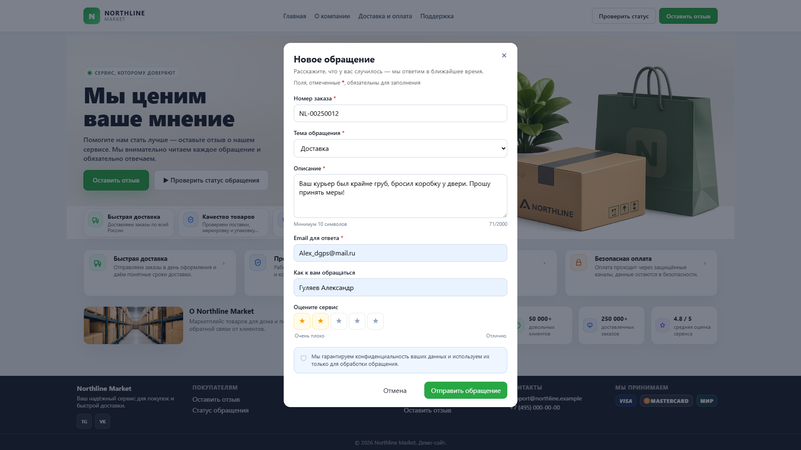

- **Что показано**: форма отправки обращения.
- **Роль в системе**: начало pipeline.
- **Почему важно**: фиксирует UX “клиент → номер обращения”.

### Отправка и получение номера

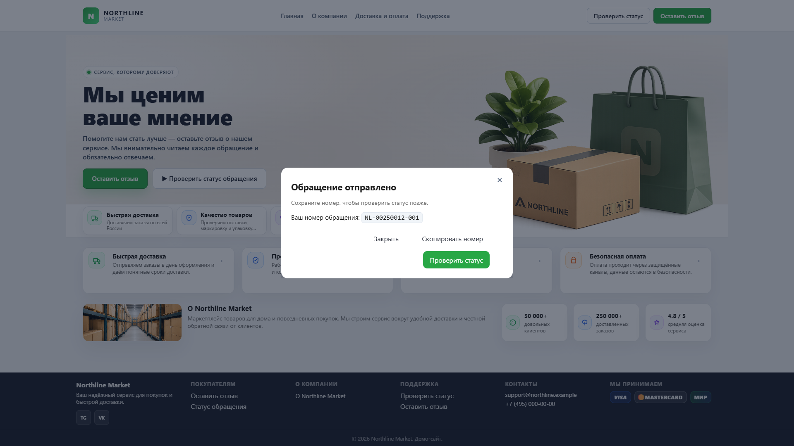

- **Что показано**: подтверждение отправки и выдача номера обращения.
- **Роль в системе**: ключевой идентификатор клиентского сценария.
- **Почему важно**: демонстрирует контракт “номер обращения → статус”.

### Проверка статуса

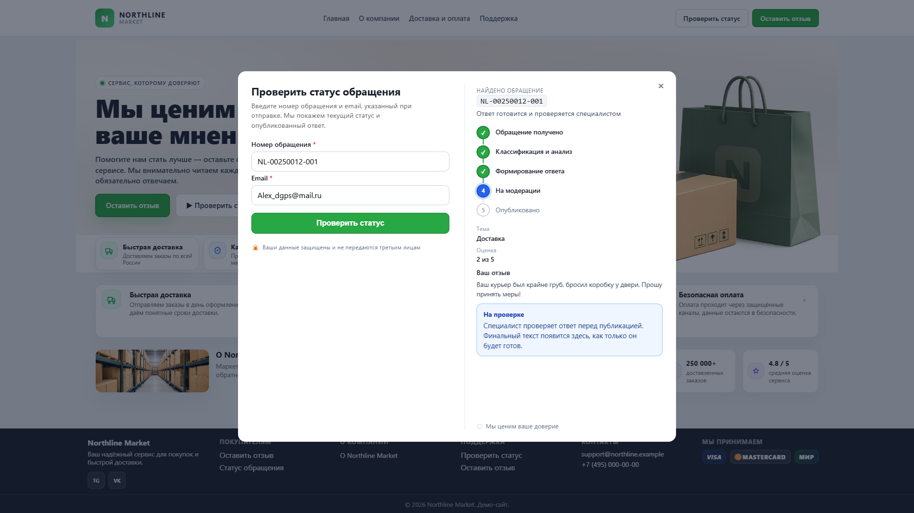

- **Что показано**: поиск статуса по номеру и email, отображение этапов обработки.
- **Роль в системе**: клиентский контроль процесса без доступа к внутренней информации.
- **Почему важно**: показывает lifecycle, не раскрывая Response Case/confidence.

### Завершённый сценарий (опубликован ответ)

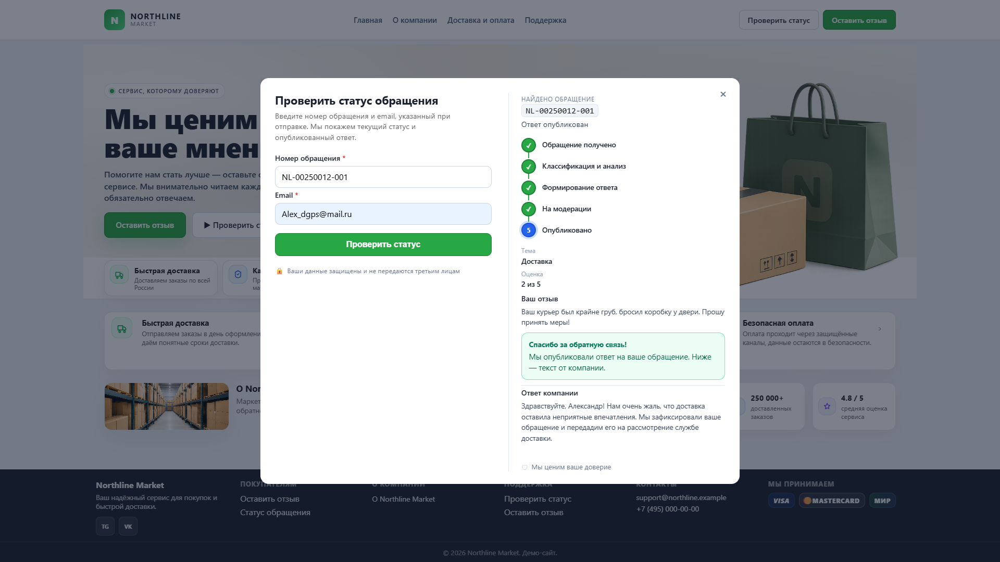

- **Что показано**: статус с опубликованным ответом.
- **Роль в системе**: финал human-in-the-loop процесса.
- **Почему важно**: визуально подтверждает “оператор публикует → клиент видит final_response”.

---

## 2) Авторизация сотрудников (контур компании)

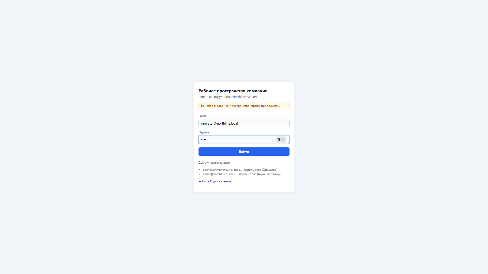

- **Что показано**: вход в рабочее пространство компании и выбор роли.
- **Роль в системе**: переход из публичного контура в внутренние консоли.
- **Почему важно**: демонстрирует разделение доступа по ролям.

---

## 3) Обычный операторский сценарий

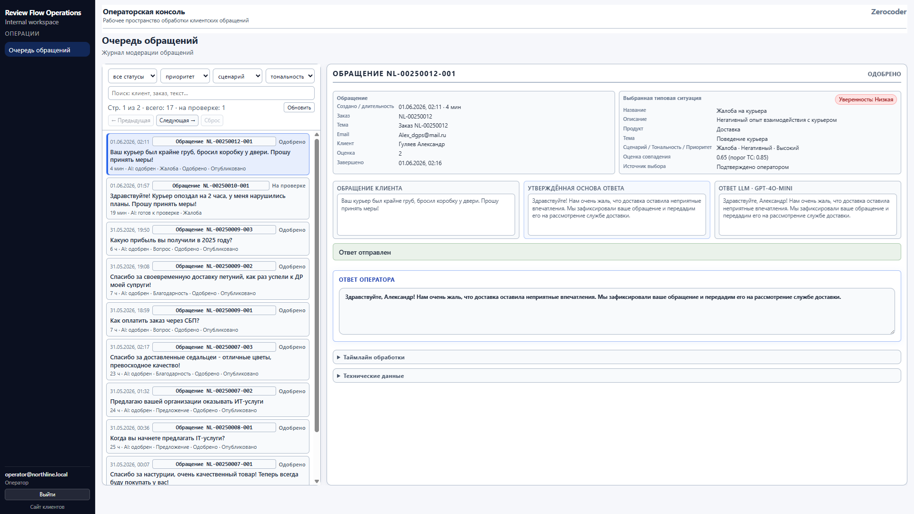

- **Что показано**: карточка обращения в операторской консоли после подтверждения/обработки.
- **Роль в системе**: human‑in‑the‑loop контроль и публикация.
- **Почему важно**: показывает рабочее место оператора и редактирование ответа.

---

## 4) Controlled Hybrid Learning Loop

### Низкая уверенность и альтернативы (retrieval + confidence)

- **Что показано**: выбранная типовая ситуация, confidence и альтернативы.
- **Роль в системе**: решение не “автоматическое” — оператор видит основания и варианты.
- **Почему важно**: демонстрирует Controlled Hybrid семантику (retrieval/decision vs LLM).

### Оператор создаёт candidate (нет подходящей ситуации)

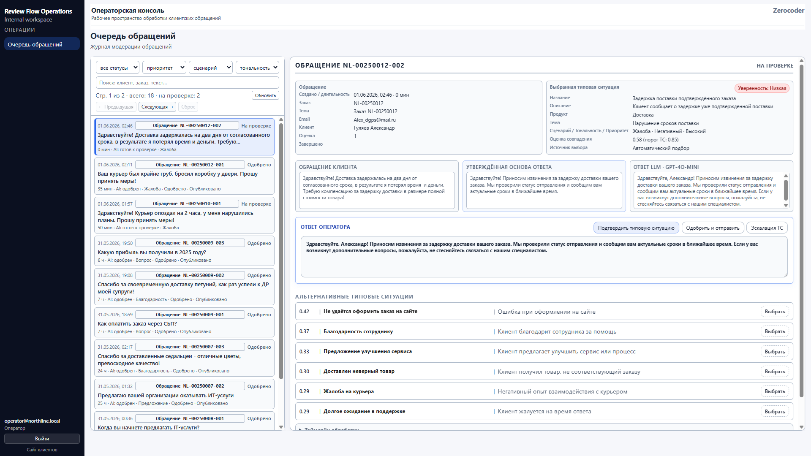
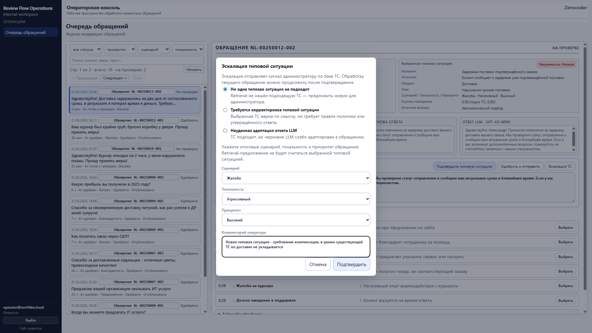

- **Что показано**: инициирование и заполнение candidate.
- **Роль в системе**: запуск learning loop.
- **Почему важно**: иллюстрирует механизм расширения базы знаний из операционного контура.

### Администратор принимает candidate

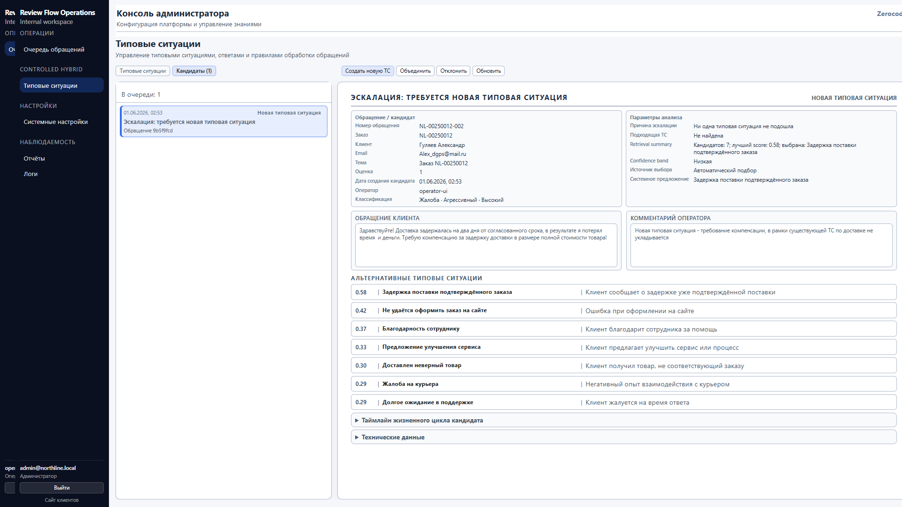

- **Что показано**: кандидат, поступивший от оператора.
- **Роль в системе**: вход в административный этап learning loop.
- **Почему важно**: отделяет ответственность оператора (сигнал) и администратора (KB‑решение).

### Создание новой типовой ситуации и включение в KB

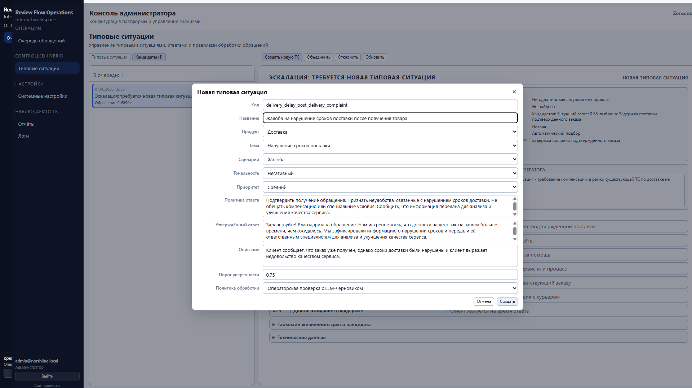
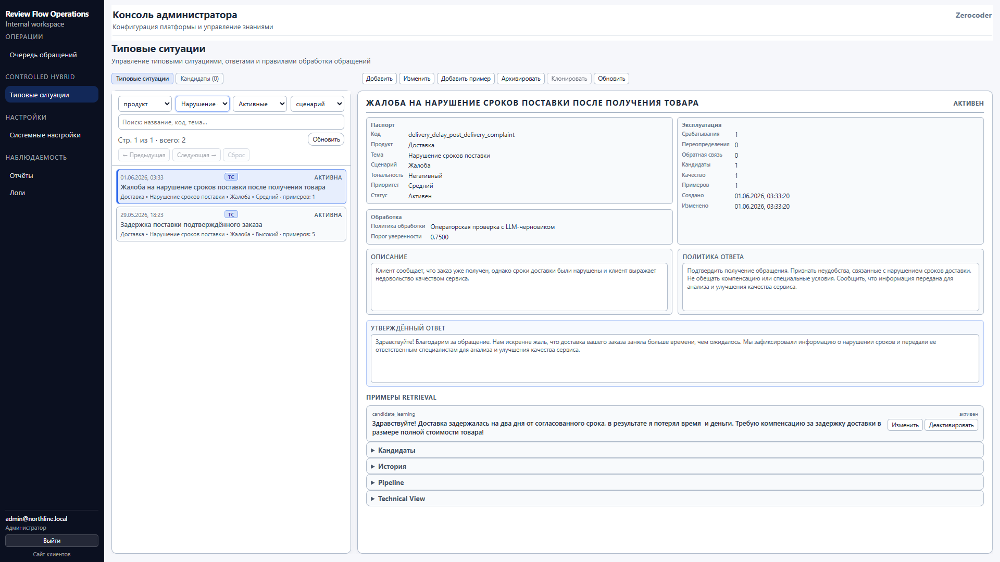

- **Что показано**: создание Response Case администратором.
- **Роль в системе**: фиксация SOT бизнес‑решения в KB.
- **Почему важно**: демонстрирует “типовая ситуация — управляемый артефакт”, а не “ответ от LLM”.

### Candidate становится retrieval‑примером

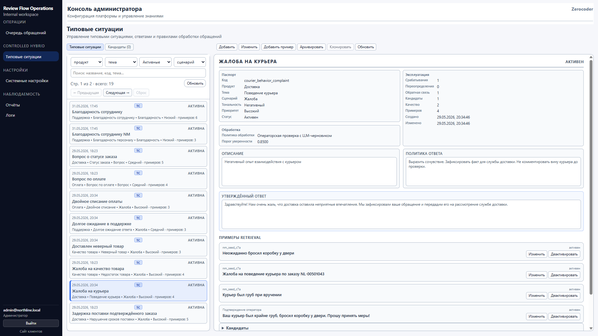

- **Что показано**: пример добавлен к типовой ситуации.
- **Роль в системе**: улучшение retrieval‑покрытия для будущих обращений.
- **Почему важно**: визуально закрывает цикл learning loop.

---

## 5) Управление типовыми ситуациями

- **Что показано**: список Response Cases.
- **Роль в системе**: основная административная база знаний Controlled Hybrid.
- **Почему важно**: показывает, где находится SOT решений.

Дополнительные примеры редактирования:

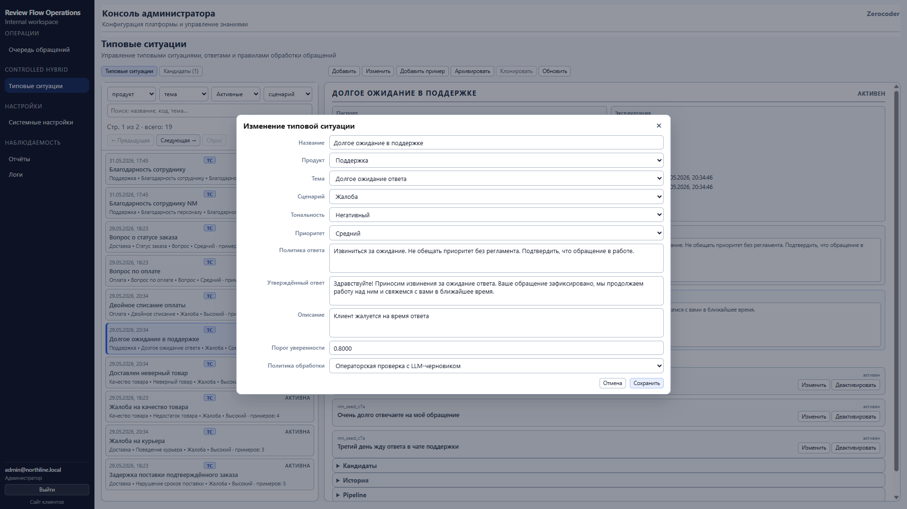
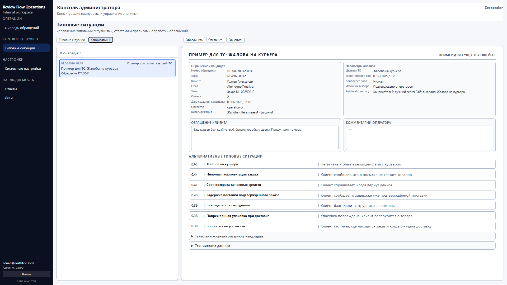
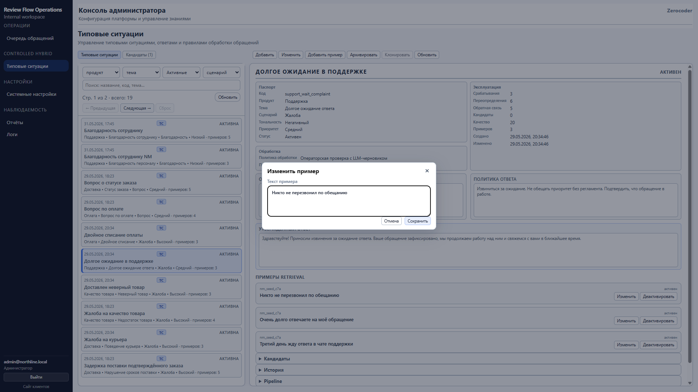

---

## 6) Отчётность

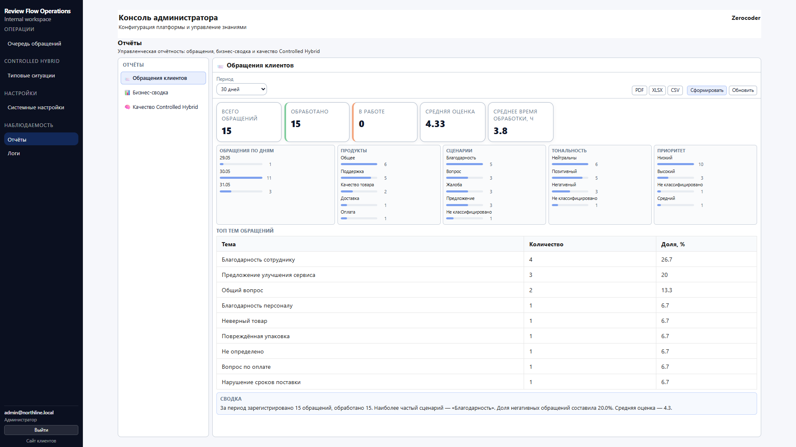
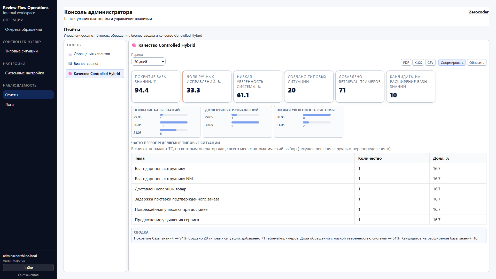

- **Что показано**: демонстрационные отчёты по работе системы.
- **Роль в системе**: витрина результатов и наблюдаемости для руководителя/аналитика.
- **Почему важно**: проект демонстрирует не только обработку, но и измеримость.

---

## 7) Системные настройки

- **Что показано**: административные настройки системы.
- **Роль в системе**: контроль параметров демо‑среды и конфигурации.
- **Почему важно**: подтверждает наличие “операционного контура”, а не только клиентской формы.

