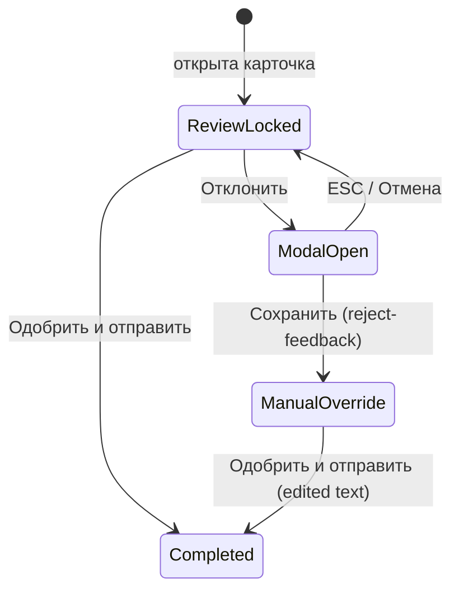

# Sprint 020G — Operator Console Semantic Rebuild + Rejection Modal v2

**Дата:** 2026-05-29  
**Задача:** `cursor_tasks_local/2026-05-29_sprint_020g_operator_console_semantic_rebuild_and_rejection_modal_v2.md`

## Цель

Семантический rebuild operator workspace под фактический pipeline (оператор проверяет AI draft, а не публикацию) и controlled rejection workflow с модальным сбором feedback.

## Semantic decisions

| Было | Стало |
|------|--------|
| «Модерация публикации», Save draft / Refresh / revision | Проверка AI draft; только «Одобрить и отправить» и «Отклонить» |
| Отклонение с inline reason → сразу API reject | «Отклонить» только открывает modal; lifecycle меняется после «Сохранить» |
| Редактор оператора всегда активен | По умолчанию locked/read-only; unlock после сохранения rejection feedback |
| Pipeline strip в detail | Удалена; telemetry в queue (строка 3) и краткая строка в detail |
| Идентификатор из case_title | `request_number` (NL-XXXXXXXX-NNN) из API |

## DB / backend

- Миграция: `infra/db/migrations/005_rejection_feedback.sql` — таблица `rejection_feedback`
- Модель: `RejectionFeedback` в `backend/app/models/entities.py`
- Сервис: `submit_ai_draft_rejection_feedback()` в `backend/app/services/moderation.py`
  - Валидация `classification_error`: минимум одно изменённое С/Т/П
  - Обновление classification + `needs_revision`, лог `ai_draft_rejected`
- API: `POST /api/operator/reviews/{id}/reject-feedback`
- Расширены `OperatorReviewListItem` / `OperatorReviewDetail`: `request_number`, `ai_review_mode`, `rejection_feedback_history`, `llm_model`, `updated_at`, `template.title`

## Frontend

| Файл | Изменение |
|------|-----------|
| `OperatorConsoleHeader.jsx` | Sticky global + workspace headers |
| `OperatorReviewsPage.jsx` | Modal state, approve/reject-feedback flow, без local draft |
| `OperatorModerationWorkspace.jsx` | KV panels, collapsible text, locked editor, 2 actions |
| `OperatorQueueItem.jsx` | 3-line structure |
| `OperatorLeftPanel.jsx` | Single-row toolbar |
| `RejectionFeedbackModal.jsx` | 3 rejection reasons + classification selects |
| `CollapsibleTextPanel.jsx` | ~5 lines + «Показать полный текст» |
| `operator-console.css` | 020G layout/modal styles, wider queue column |

## Modal flow



## Lifecycle transitions

1. **pending_review + ai_review_mode=review** — оператор видит AI draft, editor locked.
2. **Отклонить** — только UI modal, без API.
3. **Сохранить в modal** — `reject-feedback` → `needs_revision`, `ai_review_mode=manual_override`, editor unlocked, classification может обновиться.
4. **Одобрить и отправить** — если locked: отправляется `draft_response`; если override: текст из редактора.

## Build

```bash
cd frontend && npm run build
```

Успешно (Vite 6.4.2).

## Deploy note

Применить миграцию на БД перед использованием reject-feedback:

```bash
psql … -f infra/db/migrations/005_rejection_feedback.sql
```

## Screenshots

Не делались в этой сессии (headless environment).
