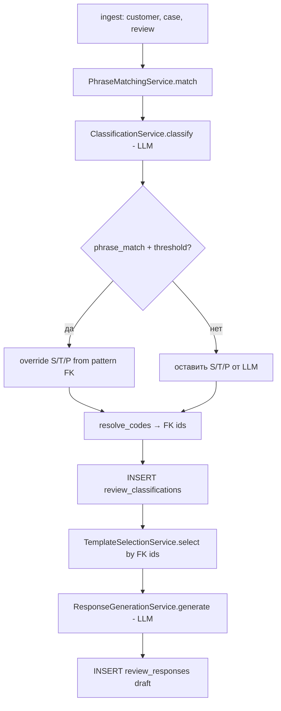

# Sprint 021B — Pipeline Forensics: Template Selection & Classification

**Date:** 2026-05-30  
**Status:** Completed  
**Type:** Read-only forensic analysis (код не изменялся)

**Task source:** `cursor_tasks_local/2026-05-30_sprint_021b_pipeline_forensics_template_selection_and_classification.md`

---

## Objective

Зафиксировать по фактическому коду backend, как в Review Flow проходит подбор шаблона ответа, phrase matching, классификация С/Т/П и генерация draft — в контексте post-021A FK reference model.

---

## Scope & constraints

- Анализ только существующего кода (snapshot после Sprint 021A).
- Без правок в репозитории.
- Без запуска pipeline на живых данных (выводы из статического разбора).

---

## Executive summary

Ответ клиенту **не выбирается готовым из БД**. Цепочка:

1. Fuzzy match типовой формулировки (`rapidfuzz`, порог 55).
2. **Всегда** LLM-классификация JSON; при успешном phrase match — post-override С/Т/П из FK фразы.
3. Resolve кодов → FK ids → запись `review_classifications`.
4. In-memory score шаблонов по `scenario_id` / `sentiment_id` / `priority_id` (после 021A).
5. LLM generation draft с подстановкой `template_text` и `classification_json` в prompt.

Entry point: `POST /api/reviews` → `ReviewPipeline.ingest_and_process()` (`backend/app/api/reviews.py`).

---

## Forensic report

### Step-by-step pipeline



| Шаг | Сервис / функция | Файл | Результат |
|-----|------------------|------|-----------|
| 0 | `create_review` → `ReviewPipeline.ingest_and_process` | `api/reviews.py`, `services/pipeline.py` | Оркестрация |
| 1 | `_get_or_create_customer`, `_create_service_case`, `_create_review` | `pipeline.py` | Ingest + commit |
| 2 | `PhraseMatchingService.match` | `phrase_matching.py` | `PhraseMatchResult` |
| 3 | `AIProviderRuntime.resolve` | `ai_provider_runtime.py` | AI provider |
| 4 | `ClassificationService.classify` | `classification.py` | `ClassificationResult` + class prompt |
| 5 | `ClassificationRefsService.resolve_codes` + `sync_classification_legacy` | `classification_refs.py` | FK rows |
| 6 | persist `ReviewClassification` | `pipeline.py` | Строка классификации |
| 7 | `TemplateSelectionService.select` | `template_selection.py` | `ResponseTemplate` |
| 8 | `ResponseGenerationService.generate` | `response_generation.py` | draft + gen metadata |
| 9 | persist `ReviewResponse` | `pipeline.py` | Draft response |

Operational events: `phrase_matching_completed`, `classification_completed`, `template_selected`, `draft_generated` (`operational_log.log_event`).

---

### 1. Подбор ответа / шаблона

Шаблон — **основа для LLM**, не финальный ответ:

- `TemplateSelectionService.select()` выбирает одну активную запись `response_templates`.
- `ResponseGenerationService.generate()` передаёт в prompt: `template_text`, `required_elements`, `forbidden_elements`, `classification_json`, `review_text`, `customer_name`, `rating`.

---

### 2. Сервисы, функции, SQL/ORM

| Этап | Функция | ORM / SQL (фактически) |
|------|---------|-------------------------|
| Phrase | `PhraseMatchingService.match` | `select(ReviewPhrasePattern).where(is_active.is_(True))` → все активные фразы в память |
| Classification lists | `_active_scenario_codes`, `_active_sentiment_codes` | `select(InteractionScenario.scenario_code)`, `select(SentimentProfile.sentiment_code)` where active |
| Classification LLM | `classify` → `ai.complete_json` | без SQL на результат |
| FK resolve | `resolve_codes` | `select` по `*_code` в `interaction_scenarios`, `sentiment_profiles`, `priority_levels` |
| Templates | `TemplateSelectionService.select` | `select(ResponseTemplate).where(is_active.is_(True))` |
| Template fallback ids | `_fallback_scenario_id`, `_fallback_sentiment_id` | `scenario_code='question'`, `sentiment_code='neutral'` |
| Generation prompt | `PromptService.get_active('review_response_generation')` | `select(PromptVersion).where(prompt_key, is_active)` |
| Class prompt | `get_active('review_classification')` | то же |
| Request seq | `_next_request_sequence` | `select(func.max(Review.request_sequence)).where(order_number=...)` |

---

### 3–4. Поиск типовой формулировки

**Используется:** да (`phrase_matching.py`).

**Не используется:** SQL `LIKE`/`ILIKE`, pg_trgm, embeddings, exact match в БД.

**Алгоритм:**

1. Загрузить все `review_phrase_patterns` с `is_active = true`.
2. Для каждой: `rapidfuzz.fuzz.token_set_ratio(review_text.lower(), pattern.phrase_text.lower())`.
3. Максимум по всем паттернам.
4. Порог: `settings.phrase_match_threshold` (default **55.0**, шкала rapidfuzz 0–100).
5. `best_score >= threshold` → `classification_source = "phrase_match"`, `matched_phrase_id` заполняется, `phrase_match_score = round(score/100, 4)`.
6. Иначе → `classification_source = "llm_fallback"`, `needs_phrase_review = True`; при `best_score > 0` объект `matched_phrase` может указывать на лучшую фразу ниже порога (в `matched_phrase_id` не пишется).

Конфиг: `backend/app/core/config.py` → `phrase_match_threshold: float = 55.0`.

---

### 5. Роль фразы для С/Т/П

| Роль | Поведение |
|------|-----------|
| Подсказка LLM | В JSON payload: `matched_phrase`, `classification_source_hint` |
| Аналитика в БД | `matched_phrase_id`, `phrase_match_score`, `classification_source`, `needs_phrase_review` |
| **Источник С/Т/П** | Только при `classification_source == "phrase_match"` и наличии `matched_phrase`: после ответа LLM поля **перезаписываются** кодами из FK фразы (`code_for_*_id` или deprecated `scenario`/`sentiment`/`priority_hint`) + `topic`/`product_area` с паттерна |

При `llm_fallback` финальные С/Т/П — от LLM (после pydantic + `resolve_codes`).

---

### 6. Определение С/Т/П

**Комбинация:**

1. **LLM всегда** — `ClassificationService.classify`: active prompt `review_classification`, JSON contract в `CLASSIFICATION_JSON_CONTRACT`, валидация `ClassificationResult` (regex на codes).
2. **Phrase override** (условно) — строки 77–95 `classification.py`, только при `phrase_match`.
3. **product_area fallback** — из review/payload, если LLM не вернул.
4. **Справочник** — `resolve_codes` в `classify` (валидация) и в `pipeline` (персист FK); unknown code → `ClassificationReferenceError` → pipeline status `failed`.

`classification_source` в `review_classifications` = значение из `PhraseMatchResult` (`phrase_match` | `llm_fallback`), **не** отдельный маркер «финальный источник scenario после override».

---

### 7–8. Выбор `response_template` и FK (021A)

`TemplateSelectionService.select(scenario_id, sentiment_id, priority_id)` — `template_selection.py`:

**Scoring (in-memory):**

- `t.scenario_id == scenario_id` → +4  
- `t.sentiment_id == sentiment_id` → +2  
- `t.priority_id == priority_id` (если учитывается) → +1  

**Каскад fallback:**

1. Лучший с score ≥ **7** (с priority).  
2. Иначе лучший с score ≥ **6** (без priority).  
3. Иначе первый шаблон с тем же `scenario_id`.  
4. Иначе `is_fallback`, или пара `question`+`neutral` по FK id, или `templates[0]`.

**После Sprint 021A:** сравнение по **`scenario_id` / `sentiment_id` / `priority_id`**, не по строкам `scenario`/`sentiment`/`priority`.

**Не участвуют в selection** (есть в модели, в коде `select` не используются): `rating_min`, `rating_max`, `topic`, `product_area` шаблона.

---

### 9. Prompt / context для LLM generation

`ResponseGenerationService.generate()` — `response_generation.py`:

- Prompt key: `PromptService.PROMPT_KEY_GENERATION` = `"review_response_generation"`.
- Context для `PromptService.render_template(user_prompt_template, context)`:

```python
context = {
    "customer_name": customer_name,
    "review_text": review.review_text,
    "rating": str(review.rating or ""),
    "classification_json": json.dumps(classification.model_dump(), ...),
    "template_text": template.template_text or "",
    "required_elements": template.required_elements or "",
    "forbidden_elements": template.forbidden_elements or "",
}
```

- `system_prompt` из active `PromptVersion`.
- Вызов: `ai.complete_text(system_prompt, user_prompt)`.
- Постобработка: `draft.replace("{{customer_name}}", customer_name)`.

Классификационный prompt формируется отдельно в `ClassificationService.classify` (ключ `review_classification`).

---

### 10. Поля при сохранении

#### `review_classifications` (`pipeline.py`, создание строки)

| Поле | Источник |
|------|----------|
| `review_id`, `prompt_version_id` | review, classification prompt |
| `matched_phrase_id` | `phrase_match.matched_phrase.id` если есть matched phrase при threshold |
| `phrase_match_score`, `classification_source`, `needs_phrase_review` | `PhraseMatchResult` |
| `scenario_id`, `sentiment_id`, `priority_id` | `ClassificationRefsService.resolve_codes` |
| `scenario`, `sentiment`, `priority` | `sync_classification_legacy` |
| `topic`, `product_area`, `confidence` | LLM (+ override из фразы) |
| `rating` | `review.rating` |
| `suggested_new_phrase` | **не заполняется** в pipeline |

#### `review_responses` (`pipeline.py`, создание строки)

| Поле | При создании |
|------|----------------|
| `review_id`, `classification_id`, `template_id` | связи |
| `prompt_version_id` | generation prompt |
| `draft_response` | LLM output |
| `generation_metadata` | provider, model, prompt_key/version/id, optional fallback flags |
| `moderation_status` | `"pending_review"` |
| `publication_status` | `"not_published"` |
| `final_response`, `operator_id` | **не задаются** |

Модель: `backend/app/models/entities.py` — `ReviewClassification`, `ReviewResponse`.

---

## Answers to task questions (1–10)

| # | Краткий ответ |
|---|----------------|
| 1 | Phrase fuzzy → LLM classify → FK resolve → score template → LLM draft |
| 2 | `pipeline`, `phrase_matching`, `classification`, `classification_refs`, `template_selection`, `response_generation`, `prompt_service`, `ai_provider_runtime` |
| 3 | Да |
| 4 | `rapidfuzz.token_set_ratio`, threshold 55; не SQL/embeddings |
| 5 | При `phrase_match` может переопределить С/Т/П; иначе подсказка/метаданные |
| 6 | Комбинация: всегда LLM + условный override из фразы |
| 7 | In-memory score по FK ids, каскад 7→6→scenario→fallback |
| 8 | Да, через `scenario_id` / `sentiment_id` / `priority_id` |
| 9 | `ResponseGenerationService.generate` + `PromptService` |
| 10 | См. таблицы персиста выше |

---

## Observations (для последующих спринтов)

Не являются дефектами в рамках 021B; зафиксированы как architectural notes:

1. LLM классификации вызывается **всегда**, даже при сильном phrase match (latency/cost).
2. `classification_source` не различает «LLM выставил scenario» vs «override из фразы после LLM».
3. `rating_min` / `rating_max` / `topic` / `product_area` шаблона не влияют на `TemplateSelectionService`.
4. При равном score порядок зависит от порядка в списке после `sorted`, не от `sort_order` в БД.

---

## Changed files

**Нет.** Задача — только анализ и документирование.

---

## Verification

```text
Метод: статический разбор исходников backend (read-only).
Проверенные файлы:
  backend/app/api/reviews.py
  backend/app/services/pipeline.py
  backend/app/services/phrase_matching.py
  backend/app/services/classification.py
  backend/app/services/classification_refs.py
  backend/app/services/template_selection.py
  backend/app/services/response_generation.py
  backend/app/services/prompt_service.py
  backend/app/core/config.py
  backend/app/models/entities.py
  backend/app/schemas/classification.py
```

---

## FULL PROMPT
Проанализируй текущую реализацию backend pipeline и ответь строго по фактическому коду:

1. Как сейчас происходит подбор ответа / шаблона ответа для обращения?
2. Какие сервисы, функции и SQL/ORM-запросы участвуют?
3. Используется ли поиск похожей типовой формулировки?
4. Если используется — по какому алгоритму: exact match, LIKE/ILIKE, similarity, embedding, score, fallback?
5. Является ли найденная типовая формулировка источником С/Т/П или только дополнительной аналитикой/подсказкой?
6. Как сейчас определяется С/Т/П: LLM, phrase matching, fallback или комбинация?
7. Как после определения С/Т/П выбирается response_template?
8. Работает ли выбор шаблона через новые FK reference tables после Sprint 021A?
9. Где именно формируется prompt/context для LLM generation?
10. Какие поля сохраняются в review_classifications и review_responses?

Никаких изменений в код не вносить.

Сделай короткий forensic report с точными ссылками на файлы/функции и фактический алгоритм step-by-step.